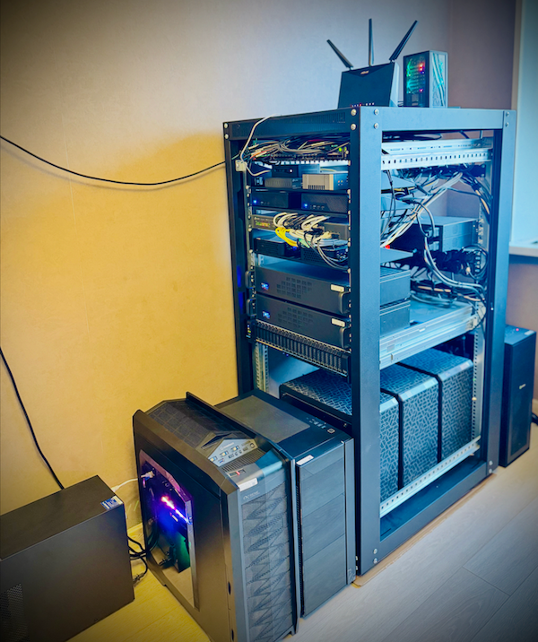

# Распределенный инференс и шардирование моделей LLM с использованием K8s, Ray Serve и vLLM

Привет, Хабр!

Меня зовут Александр Подмосковный, я работаю в МКБ и, как многие, увлекся темой искусственного интеллекта. После того как **Deepseek R1** привлек внимание сообществ, я тоже решил погрузиться в эту сферу и исследовать возможности масштабирования моделей и вычислений. Это привело меня к идее, как эффективно работать с большими моделями, используя доступное оборудование и распределенные вычисления.

---

## Моя мотивация

После того как я развернул урезанную версию модели на 32B параметров с помощью **Ollama**, у меня возник важный вопрос: "А можно ли распределить модель, которая не помещается в видеопамять одной GPU, между несколькими ГПУ?" Как оказалось, такой подход возможен, и я решил поэкспериментировать с этим, используя доступное оборудование.

Моя цель — использовать **более доступные видеокарты** для **запуска более крупных моделей**. Это помогло бы снизить порог вхождения для многих разработчиков и компаний с точки зрения **отношения инвестиции/профит**. Так родилась идея распределенной архитектуры инференса, включающей шардирование и эффективное использование нескольких видеокарт.

---

## План по написанию статьи

#### Введение
- **Общее введение в тему**: Обзор задачи, которая будет решаться. Объяснение, как использование нескольких GPU и распределение вычислений между ними может решить проблемы, связанные с ограниченной видеопамятью на одной видеокарте.
- **Цель статьи**: Подробное описание реализации распределённого инференса с использованием Ray Serve, vLLM, Kubernetes, Proxmox, и других технологий.
- **Краткое описание домашней лаборатории**: Объяснение, как была построена инфраструктура для реализации проекта.

#### Часть 1: Настройка GPU и Проброс в Proxmox
- **Настройка Proxmox для работы с GPU**: Пошаговое руководство по настройке проброса GPU через Proxmox для виртуальных машин, использование PCI passthrough.

#### Часть 2: Настройка Kubernetes, добавление GPU-узлов, установка gpu operator и kuberay operator
- **Развертывание Kubernetes-кластера**: Шаги по установке и настройке Kubernetes с помощью Deckhouse. Как добавить новые узлы с GPU в существующий кластер.
- **Использование GPU Operator**: Установка GPU Operator для автоматического управления драйверами, мониторингом и ресурсами GPU.
- **Использование KubeRay Operator**: Установка KubeRay Operator для разворачивания Ray-кластеров и управления GPU-ресурсами непосредственно внутри Kubernetes.

#### Часть 3: Написание скрипта vLLM для шардирования, распределения вычислений и Ray Serve для вывода API
- **Что такое vLLM и почему он выбран** Кратко о механизмах шардирования больших языковых моделей в vLLM (tensor parallel, NCCL) и поддержке стриминга ответов.
- **Распределение инференса и параметры шардирования** Как модель делится на части (tensor/pipeline parallel), распределяется по GPU, и как регулируется память (gpu_memory_utilization, cpu_offload_gb).
- **Что такое Ray Serve** Быстрый обзор микросервисного подхода Ray Serve, позволяющего запускать FastAPI-приложение на нескольких репликах, с удобным управлением GPU-ресурсами.
- **Описания скриптов**
  1. **serve.py**: инициализация vLLM, создание ChatCompletion-эндпоинтов, JWT-аутентификация, интеграция с Ray Serve.
  2. **auth.py**: генерация/проверка JWT, хранение данных пользователей (логины, роли, хэши паролей).

#### Часть 4: Настройка Kuberay Cluster
- **Подготовка docker образа и сохранение его в registry
- **Настройка KubeRay cluster

#### Часть 5: Настройка авторизации и интеграция с OpenWebUI
- **Настройка авторизации**: Использование OAuth2 и JWT для аутентификации пользователей и защиты API.
- **Интеграция с OpenWebUI**: Разворачивание OpenWebUI в качестве интерфейса взаимодействия с LLM и его настройкой с Ray Application API.
- **Вывод приложения в интернет**: Подключение приложения через CDN и настройка защиты с помощью WAF для безопасного доступа.

#### Часть 6: Примеры запросов и интеграция с существующими решениями
- **Примеры запросов**: Пример работы с API для генерации текста или изображений с использованием настроенной инфраструктуры.
- **Интеграция с другими решениями**: Как интегрировать настройку в существующие системы и приложения для расширения функционала.

#### Заключение
- **Резюме**: Итоги по выполнению задачи, выводы о производительности и масштабируемости решения.
- **Предложения по дальнейшему развитию**: Идеи для улучшения и расширения системы.

---
# Введение
## Моя домашняя лаборатория

Для реализации своей идеи мне потребовалась соответствующая инфраструктура. В моем распоряжении несколько серверов с GPU и распределенная вычислительная мощность.

### Оборудование:
- **7 серверов для рабочих нагрузок** — гиперконвергентные системы на базе материнских плат **Supermicro X11**:
  - **Сеть 4x10Gbe (LACP)** для высокой пропускной способности.
  - **из них 4 сервера с GPU**:
    - 1x **RTX 3060** (12Gb).
    - 3x **RTX 3090** (24Gb).
  - **NVMe диски**:
    - Часть используется для **ZFS с RAIDZ02** под БД.
    - Часть используется для **Ceph** (rbd, cephfs, rgw).
- **7 машин для control-plane и балансировок**:
  - Некоторые на **Nuc** устройствах, другие — на потребительском железе.

Всё это работает в кластере **Proxmox 8.2.7** с **Ceph 18.2**, что позволяет мне проводить эксперименты с распределенными системами.

### Управление кластерами

С помощью **Deckhouse** развернут **Kubernetes кластер**, позволяющий эффективно масштабировать систему и добавлять ноды с GPU. Этот кластер является основой для всех вычислений и развертывания моделей, таких как **LLM** (Large Language Models).

---

## Введение в распределенный инференс и шардирование

Проблема работы с большими моделями, которые не помещаются в память одной видеокарты, решается двумя основными подходами:

1. **Распределение вычислений** между несколькими GPU.
2. **Шардирование модели** — разделение модели на части (шарды), которые могут работать параллельно.

### Почему это важно?

Модели с большим числом параметров, например, **Stable Diffusion**, **GPT**, или **Deepseek R1**, требуют значительных вычислительных ресурсов. Использование нескольких видеокарт для распараллеливания инференса позволяет эффективно обрабатывать запросы без необходимости в супердорогих вычислительных мощностях.

#### Зачем шардирование?

- **Шардирование модели** позволяет разделить модель на несколько частей и загрузить их на разные GPU. Это позволяет моделям, не вмещающимся в память одного устройства, работать на нескольких видеокартах одновременно.
- В отличие от обычного распределенного инференса, где каждая видеокарта может обрабатывать один запрос, шардирование позволяет видеокартам работать параллельно с разными частями модели, делая инференс быстрее и эффективнее.

---

## Как устроен мой кластер

Для реализации распределенного инференса и шардирования модели я использую **Ray Serve** и **vLLM**. Эта архитектура позволяет распределять как данные, так и вычисления между несколькими GPU, что обеспечивает масштабируемость и высокую производительность.

### Основные компоненты:

1. **Kubernetes кластер**, развернутый с помощью **Deckhouse**. Он позволяет динамически добавлять ноды с GPU и масштабировать вычисления.
2. **Kuberay** — оператор для управления кластером **Ray**, используемый для запуска распределенных задач.
3. **Ray Serve** — компонент для развертывания API-интерфейсов, который интегрируется с **vLLM** для обработки запросов.
4. **vLLM** — библиотека для эффективного распределения инференса на несколько GPU, с использованием **NCCL** (NVIDIA Collective Communications Library), которая управляет шардированием и синхронизацией данных между GPU.

### Как все работает:

1. **Модели загружаются** и **разбиваются на части**. Каждая часть модели загружается на отдельную видеокарту.
2. **Ray Serve** обрабатывает входящие HTTP-запросы, направляя их к **vLLM**, который управляет распределением данных и вычислений.
3. **vLLM** и **NCCL** синхронизируют вычисления между GPU, что позволяет эффективно использовать всю доступную вычислительную мощность.
4. **OpenAI API совместимый endpoint** настроен через **FastAPI**, чтобы интегрироваться с другими инструментами и сервисами.

---

## Преимущества и вызовы

### Преимущества:
1. **Масштабируемость**: можно увеличивать вычислительные ресурсы, добавляя новые GPU.
2. **Экономия**: использование нескольких менее мощных видеокарт вместо одной мощной позволяет снизить затраты на оборудование.
3. **Гибкость**: архитектура легко адаптируется под разные задачи и модели.

### Вызовы:
1. **Управление нагрузкой**: необходимо эффективно управлять распределением данных и вычислений между GPU, чтобы избежать узких мест в производительности.
2. **Сложность настройки**: настройка распределенного инференса требует внимательности к деталям, например, правильного использования **NCCL** для синхронизации данных между устройствами.

---

## Как это работает на практике

Я настроил **Ray Serve** с использованием **vLLM**, чтобы создать совместимое API для **OpenAI API**. В следующем разделе я расскажу, как настроить и развернуть это решение, включая:

1. **Настройка Kubernetes (как настроить Kubernetes, добавить ноды с GPU, настроить Proxmox и подключиться к кластеру Ceph) и Ray** для распределенного инференса.
2. **Настройка vLLM** для шардирования модели и распределения вычислений между несколькими GPU.
3. **Конфигурация Ray Serve** для обработки запросов через **FastAPI**.
4. Примеры запросов и как интегрировать систему с существующими решениями.
---------

## [Часть 1: Настройка GPU и Проброс в Proxmox](part_1.md)

## [Часть 2: Настройка Kubernetes и добавление GPU-узлов](part_2.md)

## Часть 3: Настройка vLLM для шардирования и распределения вычислений

--------

## Часть 4: Настройка Ray Serve для вывода API

--------

## Часть 5: Настройка авторизации и интеграция с OpenWebUI

---------

## Часть 6: Примеры запросов и интеграция с существующими решениями

---------
