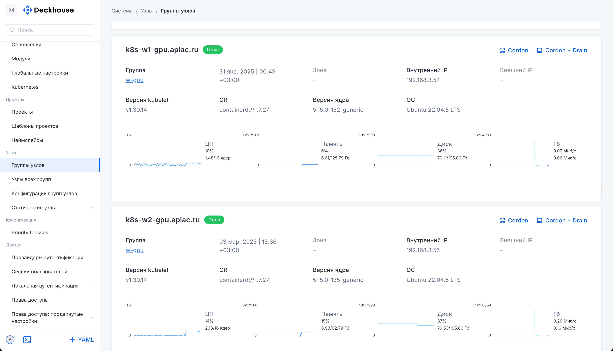
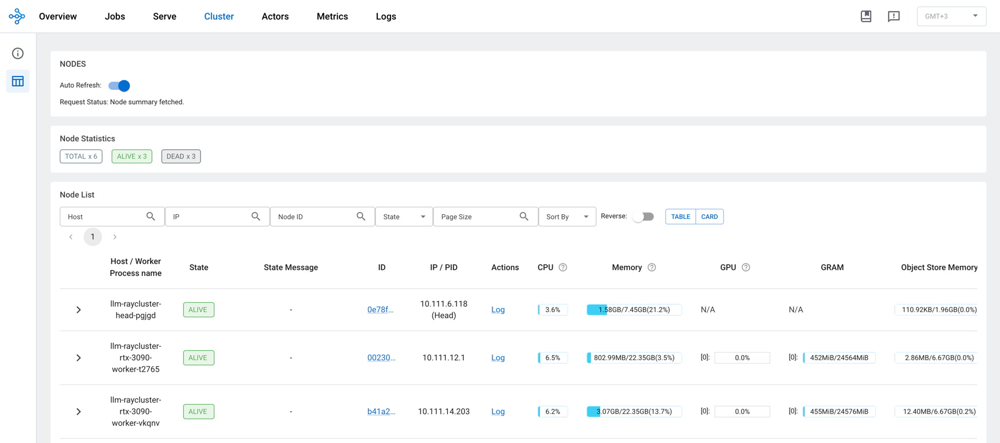
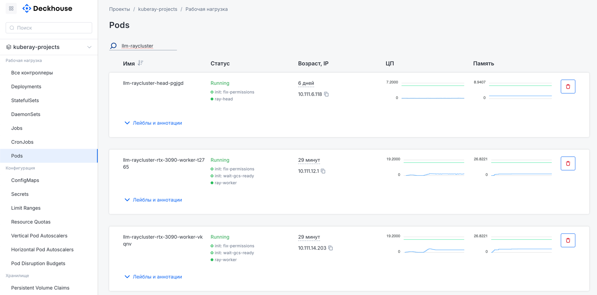
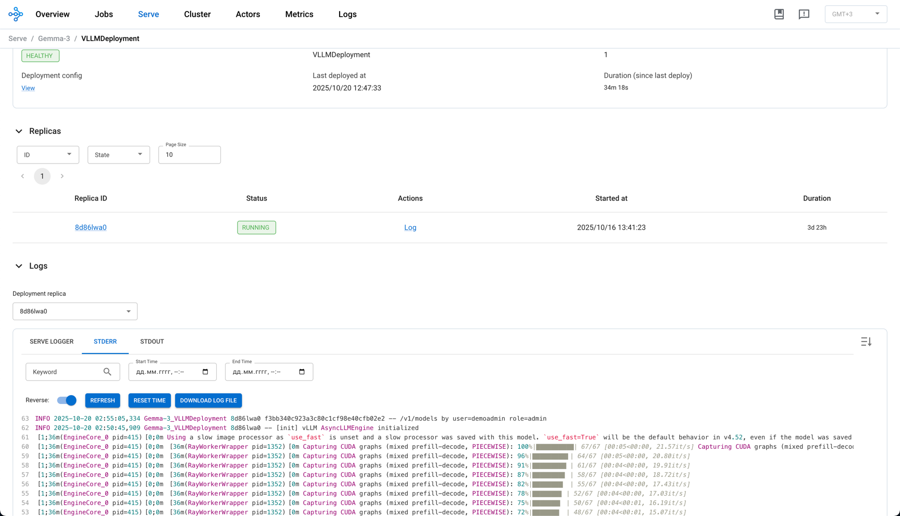
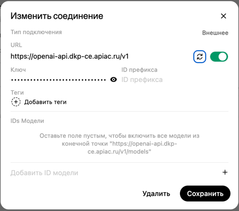
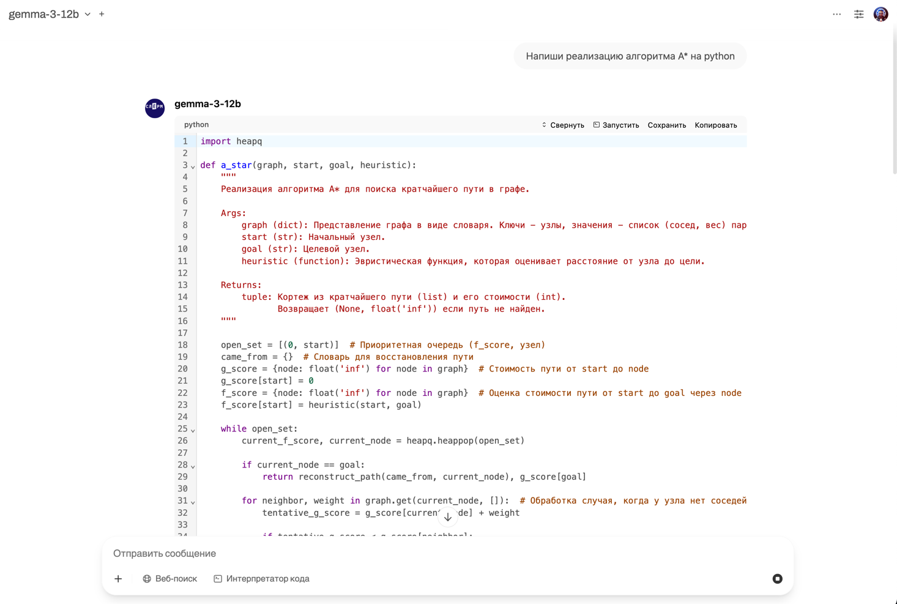
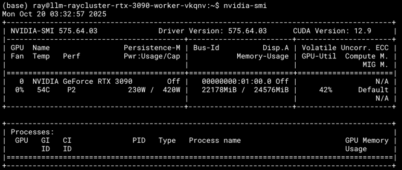

# Распределённый инференс LLM в домашней лаборатории (DKP + vLLM + KubeRay)

## Практическая часть выступления **Слёрм+Флант**.

Документ описывает пошаговый сценарий развёртывания и демонстрации распределённого инференса LLM на двух узлах с **NVIDIA RTX 3090** в кластере **Deckhouse Kubernetes Platform (DKP)**.

Используются:
- **NVIDIA GPU Operator** (драйверы/плагины/Node Feature Discovery),
- **KubeRay Operator** (управление Ray-кластерами),
- **Ray Serve + vLLM** (инференс OpenAI‑совместимым API),
- интеграция с **OpenWebUI** как клиентским интерфейсом.

---

## Содержание
1. [Предварительные требования](#предварительные-требования)
2. [Подключение двух GPU‑нод к DKP](#1-подключение-двух-gpu-нод-к-dkp)
3. [Установка NVIDIA GPU Operator](#2-установка-nvidia-gpu-operator)
4. [Установка KubeRay Operator (+ CRD)](#3-установка-kuberay-operator--crd)
5. [Сборка образа Ray + vLLM + serve.py и публикация в Registry](#4-сборка-образа-ray--vllm--servepy-и-публикация-в-registry)
6. [Развёртывание Ray‑кластера Helm‑чартом](#5-развёртывание-ray-кластера-helm-чартом)
7. [Проверки готовности кластера](#6-проверки-готовности-кластера)
8. [Запуск vLLM‑приложения через Ray Serve API](#7-запуск-vllm-приложения-через-ray-serve-api)
9. [Интеграция с OpenWebUI](#8-интеграция-с-openwebui)
10. [Демонстрация инференса](#9-демонстрация-инференса)
11. [Диагностика и типовые проблемы](#диагностика-и-типовые-проблемы)

---

## Предварительные требования

- [DKP-CE‑кластер](https://github.com/deckhouse/deckhouse) с доступом администратора: [быстрая установка](https://deckhouse.ru/products/kubernetes-platform/gs/#gui-install) (`kubectl`, `helm`, `argocd`).
- Две ноды с **NVIDIA RTX 3090** (24GB) в одной worker‑группе.
- Подтверждённая совместимость версий:
    - Драйвер **NVIDIA 575.64.03** (или совместимый с CUDA 12.8).
    - Базовый образ Ray: `rayproject/ray:2.49.0.66438d-py312-cu128`.
    - vLLM **0.10.1.1**.
- Внешний реестр контейнеров (например, GitLab Container Registry) и `imagePullSecret`.
- DNS/Ingress до Ray dashboard (для REST API и демо).
- PVC для кэша моделей HF (`/data/model-cache`).


## 1) Подключение двух GPU‑нод к DKP

**Статические инстансы** (пример для двух узлов):

```yaml
---
apiVersion: deckhouse.io/v1
kind: NodeGroup
metadata:
  name: w-gpu
spec:
  nodeTemplate:
    labels:
      node.deckhouse.io/group: w-gpu
    taints:
      - effect: NoExecute
        key: dedicated.apiac.ru
        value: w-gpu
  chaos:
    mode: Disabled
  disruptions:
    approvalMode: Automatic
  staticInstances:
    count: 2
    labelSelector:
      matchLabels:
        role: worker
        type: w-gpu
  nodeType: Static
---
apiVersion: deckhouse.io/v1alpha1
kind: StaticInstance
metadata:
  name: k8s-w1-gpu.apiac.ru
  labels:
    role: worker
    type: w-gpu
spec:
  address: "192.168.3.54"
  credentialsRef:
    kind: SSHCredentials
    name: caps
---
apiVersion: deckhouse.io/v1alpha1
kind: StaticInstance
metadata:
  name: k8s-w2-gpu.apiac.ru
  labels:
    role: worker
    type: w-gpu
spec:
  address: "192.168.3.55"
  credentialsRef:
    kind: SSHCredentials
    name: caps
```

В интерфейсе видим успешно подключенные GPU ноды:



## 2) Установка NVIDIA GPU Operator

Разворачиваем через Argo CD (или Helm). Ниже **values.yaml** (с учётом NFD, device‑plugin, time‑slicing, MIG‑manager отключён по умолчанию, драйвер управляется извне):

<details>
<summary>values.yaml</summary>

```yaml
# Default values for gpu-operator.
# This is a YAML-formatted file.
# Declare variables to be passed into your templates.

platform:
  openshift: false

nfd:
  enabled: true
  nodefeaturerules: false

psa:
  enabled: false

cdi:
  enabled: true
  default: true

sandboxWorkloads:
  enabled: true
  defaultWorkload: "container"

hostPaths:
  # rootFS represents the path to the root filesystem of the host.
  # This is used by components that need to interact with the host filesystem
  # and as such this must be a chroot-able filesystem.
  # Examples include the MIG Manager and Toolkit Container which may need to
  # stop, start, or restart systemd services
  rootFS: "/"

  # driverInstallDir represents the root at which driver files including libraries,
  # config files, and executables can be found.
  driverInstallDir: "/run/nvidia/driver"

daemonsets:
  labels: {}
  annotations: {}
  priorityClassName: system-node-critical
  tolerations:
    - key: nvidia.com/gpu
      operator: Exists
      effect: NoSchedule
    - key: dedicated.apiac.ru
      value: w-gpu
      operator: Equal
      effect: NoExecute
  # configuration for controlling update strategy("OnDelete" or "RollingUpdate") of GPU Operands
  # note that driver Daemonset is always set with OnDelete to avoid unintended disruptions
  updateStrategy: "RollingUpdate"
  # configuration for controlling rolling update of GPU Operands
  rollingUpdate:
    # maximum number of nodes to simultaneously apply pod updates on.
    # can be specified either as number or percentage of nodes. Default 1.
    maxUnavailable: "1"

validator:
  repository: nvcr.io/nvidia/cloud-native
  image: gpu-operator-validator
  # If version is not specified, then default is to use chart.AppVersion
  #version: ""
  imagePullPolicy: IfNotPresent
  imagePullSecrets: []
  env: []
  args: []
  resources: {}
  plugin:
    env:
      - name: WITH_WORKLOAD
        value: "false"

operator:
  repository: nvcr.io/nvidia
  image: gpu-operator
  # If version is not specified, then default is to use chart.AppVersion
  #version: ""
  imagePullPolicy: IfNotPresent
  imagePullSecrets: []
  priorityClassName: system-node-critical
  runtimeClass: nvidia
  use_ocp_driver_toolkit: true
  # cleanup CRD on chart un-install
  cleanupCRD: false
  # upgrade CRD on chart upgrade, requires --disable-openapi-validation flag
  # to be passed during helm upgrade.
  upgradeCRD: false
  initContainer:
    image: cuda
    repository: nvcr.io/nvidia
    version: 12.8.1-base-ubi9
    imagePullPolicy: IfNotPresent
  tolerations:
    - key: "node-role.kubernetes.io/master"
      operator: "Equal"
      value: ""
      effect: "NoSchedule"
    - key: "node-role.kubernetes.io/control-plane"
      operator: "Equal"
      value: ""
      effect: "NoSchedule"
    - key: dedicated.apiac.ru
      value: w-gpu
      operator: Equal
      effect: NoExecute
  annotations:
    openshift.io/scc: restricted-readonly
  affinity:
    nodeAffinity:
      preferredDuringSchedulingIgnoredDuringExecution:
        - weight: 1
          preference:
            matchExpressions:
              - key: "node-role.kubernetes.io/master"
                operator: In
                values: [""]
        - weight: 1
          preference:
            matchExpressions:
              - key: "node-role.kubernetes.io/control-plane"
                operator: In
                values: [""]
  logging:
    # Zap time encoding (one of 'epoch', 'millis', 'nano', 'iso8601', 'rfc3339' or 'rfc3339nano')
    timeEncoding: epoch
    # Zap Level to configure the verbosity of logging. Can be one of 'debug', 'info', 'error', or any integer value > 0 which corresponds to custom debug levels of increasing verbosity
    level: info
    # Development Mode defaults(encoder=consoleEncoder,logLevel=Debug,stackTraceLevel=Warn)
    # Production Mode defaults(encoder=jsonEncoder,logLevel=Info,stackTraceLevel=Error)
    develMode: false
  resources:
    limits:
      cpu: 500m
      memory: 350Mi
    requests:
      cpu: 200m
      memory: 100Mi

mig:
  strategy: mixed

driver:
  enabled: false
  nvidiaDriverCRD:
    enabled: false
    deployDefaultCR: true
    driverType: gpu
    nodeSelector:
      node.deckhouse.io/group: "w-gpu"
  kernelModuleType: "auto"

  # NOTE: useOpenKernelModules has been deprecated and made no-op. Please use kernelModuleType instead.
  # useOpenKernelModules: false

  # use pre-compiled packages for NVIDIA driver installation.
  # only supported for as a tech-preview feature on ubuntu22.04 kernels.
  usePrecompiled: false
  repository: nvcr.io/nvidia
  image: driver
  version: "570.148.08"
  imagePullPolicy: IfNotPresent
  imagePullSecrets: []
  startupProbe:
    initialDelaySeconds: 60
    periodSeconds: 10
    # nvidia-smi can take longer than 30s in some cases
    # ensure enough timeout is set
    timeoutSeconds: 60
    failureThreshold: 120
  rdma:
    enabled: false
    useHostMofed: false
  upgradePolicy:
    # global switch for automatic upgrade feature
    # if set to false all other options are ignored
    autoUpgrade: true
    # how many nodes can be upgraded in parallel
    # 0 means no limit, all nodes will be upgraded in parallel
    maxParallelUpgrades: 1
    # maximum number of nodes with the driver installed, that can be unavailable during
    # the upgrade. Value can be an absolute number (ex: 5) or
    # a percentage of total nodes at the start of upgrade (ex:
    # 10%). Absolute number is calculated from percentage by rounding
    # up. By default, a fixed value of 25% is used.'
    maxUnavailable: 25%
    # options for waiting on pod(job) completions
    waitForCompletion:
      timeoutSeconds: 0
      podSelector: ""
    # options for gpu pod deletion
    gpuPodDeletion:
      force: false
      timeoutSeconds: 300
      deleteEmptyDir: false
    # options for node drain (`kubectl drain`) before the driver reload
    # this is required only if default GPU pod deletions done by the operator
    # are not sufficient to re-install the driver
    drain:
      enable: true
      force: true
      podSelector: ""
      # It's recommended to set a timeout to avoid infinite drain in case non-fatal error keeps happening on retries
      timeoutSeconds: 300
      deleteEmptyDir: false
  manager:
    image: k8s-driver-manager
    repository: nvcr.io/nvidia/cloud-native
    # When choosing a different version of k8s-driver-manager, DO NOT downgrade to a version lower than v0.6.4
    # to ensure k8s-driver-manager stays compatible with gpu-operator starting from v24.3.0
    version: v0.8.0
    imagePullPolicy: IfNotPresent
    env:
      - name: ENABLE_GPU_POD_EVICTION
        value: "true"
      - name: ENABLE_AUTO_DRAIN
        value: "true"
      - name: DRAIN_USE_FORCE
        value: "true"
      - name: DRAIN_POD_SELECTOR_LABEL
        value: ""
      - name: DRAIN_TIMEOUT_SECONDS
        value: "0s"
      - name: DRAIN_DELETE_EMPTYDIR_DATA
        value: "false"
  env: []
  resources: {}
  # Private mirror repository configuration
  repoConfig:
    configMapName: ""
  # custom ssl key/certificate configuration
  certConfig:
    name: ""
  # vGPU licensing configuration
  licensingConfig:
    configMapName: ""
    nlsEnabled: true
  # vGPU topology daemon configuration
  virtualTopology:
    config: ""
  # kernel module configuration for NVIDIA driver
  kernelModuleConfig:
    name: ""

toolkit:
  enabled: true
  repository: nvcr.io/nvidia/k8s
  image: container-toolkit
  version: v1.17.8-ubuntu20.04
  imagePullPolicy: IfNotPresent
  imagePullSecrets: []
  env: []
  resources: {}
  installDir: "/usr/local/nvidia"

devicePlugin:
  enabled: true
  repository: nvcr.io/nvidia
  image: k8s-device-plugin
  version: v0.17.3
  imagePullPolicy: IfNotPresent
  imagePullSecrets: []
  args: []
  env:
    - name: PASS_DEVICE_SPECS
      value: "true"
    - name: FAIL_ON_INIT_ERROR
      value: "true"
    - name: DEVICE_LIST_STRATEGY
      value: envvar
    - name: DEVICE_ID_STRATEGY
      value: uuid
    - name: NVIDIA_VISIBLE_DEVICES
      value: all
    - name: NVIDIA_DRIVER_CAPABILITIES
      value: all
  resources: {}
  # Plugin configuration
  # Use "name" to either point to an existing ConfigMap or to create a new one with a list of configurations(i.e with create=true).
  # Use "data" to build an integrated ConfigMap from a set of configurations as
  # part of this helm chart. An example of setting "data" might be:
  # config:
  #   name: device-plugin-config
  #   create: true
  #   data:
  #     default: |-
  #       version: v1
  #       flags:
  #         migStrategy: none
  #     mig-single: |-
  #       version: v1
  #       flags:
  #         migStrategy: single
  #     mig-mixed: |-
  #       version: v1
  #       flags:
  #         migStrategy: mixed
  config:
    # Create a ConfigMap (default: false)
    create: true
    # ConfigMap name (either exiting or to create a new one with create=true above)
    name: "device-plugin-config"
    # Default config name within the ConfigMap
    default: "default.yml"
    # Data section for the ConfigMap to create (i.e only applies when create=true)
    data:
      default.yml: |-
        version: v1
        flags:
        migStrategy: "none"
        failOnInitError: true
        nvidiaDriverRoot: "/"
        plugin:
          passDeviceSpecs: true
          deviceListStrategy: "envvar"
          deviceIDStrategy: "uuid"
        sharing:
          timeSlicing:
            renameByDefault: false
            resources:
            - name: nvidia.com/gpu
              replicas: 4
      tesla-t4.yml: |-
        version: v1
        flags:
          migStrategy: none
        sharing:
          timeSlicing:
            resources:
            - name: nvidia.com/gpu
              replicas: 8
  #      data:
  #        config.yml:
  #          version: v1
  #          mig-configs:
  #            all-disabled:
  #              - devices: all
  #                mig-enabled: false
  #            a40-19:
  #              # A100-40GB
  #              - device-filter: ["0x20B010DE", "0x20B110DE", "0x20F110DE"]
  #                devices: all
  #                mig-enabled: true
  #                mig-devices:
  #                 "1g.5gb": 7
  #              # A100-80GB
  #              - device-filter: ["0x20B210DE", "0x20B510DE"]
  #                devices: all
  #                mig-enabled: true
  #                mig-devices:
  #                 "1g.10gb": 7
  #            a40-8:
  #              # A100-40GB
  #              - device-filter: [ "0x20B010DE", "0x20B110DE", "0x20F110DE" ]
  #                devices: all
  #                mig-enabled: true
  #                mig-devices:
  #                  "2g.10gb": 2
  #                  "3g.20gb": 1
  #              # A100-80GB
  #              - device-filter: [ "0x20B210DE", "0x20B510DE" ]
  #                devices: all
  #                mig-enabled: true
  #                mig-devices:
  #                  "2g.20gb": 2
  #                  "3g.40gb": 1
  #            a40-10:
  #              # A100-40GB
  #              - device-filter: [ "0x20B010DE", "0x20B110DE", "0x20F110DE" ]
  #                devices: all
  #                mig-enabled: true
  #                mig-devices:
  #                  "1g.5gb": 2
  #                  "2g.10gb": 1
  #                  "3g.20gb": 1
  #              # A100-80GB
  #              - device-filter: [ "0x20B210DE", "0x20B510DE" ]
  #                devices: all
  #                mig-enabled: true
  #                mig-devices:
  #                  "1g.10gb": 2
  #                  "2g.20gb": 1
  #                  "3g.40gb": 1
  #            a40-12:
  #              # A100-40GB
  #              - device-filter: [ "0x20B010DE", "0x20B110DE", "0x20F110DE" ]
  #                devices: all
  #                mig-enabled: true
  #                mig-devices:
  #                  "1g.5gb": 1
  #                  "2g.10gb": 3
  #              # A100-80GB
  #              - device-filter: [ "0x20B210DE", "0x20B510DE" ]
  #                devices: all
  #                mig-enabled: true
  #                mig-devices:
  #                  "1g.10gb": 1
  #                  "2g.20gb": 3
  #            # A30-24GB
  #            a30-5:
  #              - devices: all
  #                mig-enabled: true
  #                mig-devices:
  #                  "1g.6gb": 4

  # MPS related configuration for the plugin
  mps:
    # MPS root path on the host
    root: "/run/nvidia/mps"

# standalone dcgm hostengine
dcgm:
  # disabled by default to use embedded nv-hostengine by exporter
  enabled: false
  repository: nvcr.io/nvidia/cloud-native
  image: dcgm
  version: 4.2.3-1-ubuntu22.04
  imagePullPolicy: IfNotPresent
  args: []
  env: []
  resources: {}

dcgmExporter:
  enabled: false
  repository: nvcr.io/nvidia/k8s
  image: dcgm-exporter
  version: 4.2.3-4.1.3-ubuntu22.04
  imagePullPolicy: IfNotPresent
  env:
    - name: DCGM_EXPORTER_LISTEN
      value: ":9400"
    - name: DCGM_EXPORTER_KUBERNETES
      value: "true"
    - name: DCGM_EXPORTER_COLLECTORS
      value: "/etc/dcgm-exporter/dcp-metrics-included.csv"
  resources: {}
  service:
    internalTrafficPolicy: Cluster
  serviceMonitor:
    enabled: false
    interval: 15s
    honorLabels: false
    additionalLabels: {}
    relabelings: []
    # - source_labels:
    #     - __meta_kubernetes_pod_node_name
    #   regex: (.*)
    #   target_label: instance
    #   replacement: $1
    #   action: replace
  # DCGM Exporter configuration
  # This block is used to configure DCGM Exporter to emit a customized list of metrics.
  # Use "name" to either point to an existing ConfigMap or to create a new one with a
  # list of configurations (i.e with create=true).
  # When pointing to an existing ConfigMap, the ConfigMap must exist in the same namespace as the release.
  # The metrics are expected to be listed under a key called `dcgm-metrics.csv`.
  # Use "data" to build an integrated ConfigMap from a set of custom metrics as
  # part of the chart. An example of some custom metrics are shown below. Note that
  # the contents of "data" must be in CSV format and be valid DCGM Exporter metric configurations.
  config:
    name: metrics-config
            # create: true
            # data: |-
            # Format
            # If line starts with a '#' it is considered a comment
            # DCGM FIELD, Prometheus metric type, help message

            # Clocks
            # DCGM_FI_DEV_SM_CLOCK,  gauge, SM clock frequency (in MHz).
    # DCGM_FI_DEV_MEM_CLOCK, gauge, Memory clock frequency (in MHz).
gfd:
  enabled: true
  repository: nvcr.io/nvidia
  image: k8s-device-plugin
  version: v0.17.3
  imagePullPolicy: IfNotPresent
  imagePullSecrets: []
  env:
    - name: GFD_SLEEP_INTERVAL
      value: 60s
    - name: GFD_FAIL_ON_INIT_ERROR
      value: "true"
  resources: {}

migManager:
  enabled: true
  repository: nvcr.io/nvidia/cloud-native
  image: k8s-mig-manager
  version: v0.12.2-ubuntu20.04
  imagePullPolicy: IfNotPresent
  imagePullSecrets: []
  env:
    - name: WITH_REBOOT
      value: "false"
  resources: {}
  # MIG configuration
  # Use "name" to either point to an existing ConfigMap or to create a new one with a list of configurations(i.e with create=true).
  # Use "data" to build an integrated ConfigMap from a set of configurations as
  # part of this helm chart. An example of setting "data" might be:
  # config:
  #   name: custom-mig-parted-configs
  #   create: true
  #   data:
  #     config.yaml: |-
  #       version: v1
  #       mig-configs:
  #         all-disabled:
  #           - devices: all
  #             mig-enabled: false
  #         custom-mig:
  #           - devices: [0]
  #             mig-enabled: false
  #           - devices: [1]
  #              mig-enabled: true
  #              mig-devices:
  #                "1g.10gb": 7
  #           - devices: [2]
  #             mig-enabled: true
  #             mig-devices:
  #               "2g.20gb": 2
  #               "3g.40gb": 1
  #           - devices: [3]
  #             mig-enabled: true
  #             mig-devices:
  #               "3g.40gb": 1
  #               "4g.40gb": 1
  config:
    default: "all-disabled"
    # Create a ConfigMap (default: false)
    create: false
    # ConfigMap name (either existing or to create a new one with create=true above)
    name: ""
    # Data section for the ConfigMap to create (i.e only applies when create=true)
    data: {}
  gpuClientsConfig:
    name: ""

nodeStatusExporter:
  enabled: false
  repository: nvcr.io/nvidia/cloud-native
  image: gpu-operator-validator
  # If version is not specified, then default is to use chart.AppVersion
  #version: ""
  imagePullPolicy: IfNotPresent
  imagePullSecrets: []
  resources: {}

gds:
  enabled: false
  repository: nvcr.io/nvidia/cloud-native
  image: nvidia-fs
  version: "2.20.5"
  imagePullPolicy: IfNotPresent
  imagePullSecrets: []
  env: []
  args: []

gdrcopy:
  enabled: false
  repository: nvcr.io/nvidia/cloud-native
  image: gdrdrv
  version: "v2.5"
  imagePullPolicy: IfNotPresent
  imagePullSecrets: []
  env: []
  args: []

vgpuManager:
  enabled: false
  repository: ""
  image: vgpu-manager
  version: ""
  imagePullPolicy: IfNotPresent
  imagePullSecrets: []
  env: []
  resources: {}
  driverManager:
    image: k8s-driver-manager
    repository: nvcr.io/nvidia/cloud-native
    # When choosing a different version of k8s-driver-manager, DO NOT downgrade to a version lower than v0.6.4
    # to ensure k8s-driver-manager stays compatible with gpu-operator starting from v24.3.0
    version: v0.8.0
    imagePullPolicy: IfNotPresent
    env:
      - name: ENABLE_GPU_POD_EVICTION
        value: "false"
      - name: ENABLE_AUTO_DRAIN
        value: "false"

vgpuDeviceManager:
  enabled: false
  repository: nvcr.io/nvidia/cloud-native
  image: vgpu-device-manager
  version: v0.3.0
  imagePullPolicy: IfNotPresent
  imagePullSecrets: []
  env: []
  config:
    name: ""
    default: "default"

vfioManager:
  enabled: false
  repository: nvcr.io/nvidia
  image: cuda
  version: 12.8.1-base-ubi9
  imagePullPolicy: IfNotPresent
  imagePullSecrets: []
  env: []
  resources: {}
  driverManager:
    image: k8s-driver-manager
    repository: nvcr.io/nvidia/cloud-native
    # When choosing a different version of k8s-driver-manager, DO NOT downgrade to a version lower than v0.6.4
    # to ensure k8s-driver-manager stays compatible with gpu-operator starting from v24.3.0
    version: v0.8.0
    imagePullPolicy: IfNotPresent
    env:
      - name: ENABLE_GPU_POD_EVICTION
        value: "false"
      - name: ENABLE_AUTO_DRAIN
        value: "false"

kataManager:
  enabled: false
  config:
    artifactsDir: "/opt/nvidia-gpu-operator/artifacts/runtimeclasses"
    runtimeClasses:
      - name: kata-nvidia-gpu
        nodeSelector: {}
        artifacts:
          url: nvcr.io/nvidia/cloud-native/kata-gpu-artifacts:ubuntu22.04-535.54.03
          pullSecret: ""
      - name: kata-nvidia-gpu-snp
        nodeSelector:
          "nvidia.com/cc.capable": "true"
        artifacts:
          url: nvcr.io/nvidia/cloud-native/kata-gpu-artifacts:ubuntu22.04-535.86.10-snp
          pullSecret: ""
  repository: nvcr.io/nvidia/cloud-native
  image: k8s-kata-manager
  version: v0.2.3
  imagePullPolicy: IfNotPresent
  imagePullSecrets: []
  env: []
  resources: {}

sandboxDevicePlugin:
  enabled: false
  repository: nvcr.io/nvidia
  image: kubevirt-gpu-device-plugin
  version: v1.3.1
  imagePullPolicy: IfNotPresent
  imagePullSecrets: []
  args: []
  env: []
  resources: {}

ccManager:
  enabled: false
  defaultMode: "off"
  repository: nvcr.io/nvidia/cloud-native
  image: k8s-cc-manager
  version: v0.1.1
  imagePullPolicy: IfNotPresent
  imagePullSecrets: []
  env:
    - name: CC_CAPABLE_DEVICE_IDS
      value: "0x2339,0x2331,0x2330,0x2324,0x2322,0x233d"
  resources: {}

node-feature-discovery:
  priorityClassName: system-node-critical
  gc:
    enable: true
    replicaCount: 1
    serviceAccount:
      name: node-feature-discovery
      create: false
  worker:
    serviceAccount:
      name: node-feature-discovery
      # disable creation to avoid duplicate serviceaccount creation by master spec below
      create: false
    tolerations:
      - key: "node-role.kubernetes.io/master"
        operator: "Equal"
        value: ""
        effect: "NoSchedule"
      - key: "node-role.kubernetes.io/control-plane"
        operator: "Equal"
        value: ""
        effect: "NoSchedule"
      - key: nvidia.com/gpu
        operator: Exists
        effect: NoSchedule
      - key: dedicated.apiac.ru
        value: w-gpu
        operator: Equal
        effect: NoExecute
    config:
      extraLabelNs: ["nvidia.com"]
      sources:
        pci:
          deviceClassWhitelist:
            - "02"
            - "0200"
            - "0207"
            - "0300"
            - "0302"
          deviceLabelFields:
            - vendor
  master:
    serviceAccount:
      name: node-feature-discovery
      create: true
    config:
      extraLabelNs: ["nvidia.com"]
      # noPublish: false
      # resourceLabels: ["nvidia.com/feature-1","nvidia.com/feature-2"]
      # enableTaints: false
      # labelWhiteList: "nvidia.com/gpu"
```
</details>

Применение (вариант Helm):
```bash
helm upgrade --install gpu-operator nvidia/gpu-operator \
  --namespace gpu-operator --create-namespace \
  -f values-gpu-operator.yaml
```

Проверка:
```bash
kubectl -n gpu-operator get pods
kubectl get nodes -L nvidia.com/gpu.product -L nvidia.com/gpu.present
kubectl get nodes -o custom-columns=NAME:.metadata.name,GPUs:.status.allocatable.'nvidia\.com/gpu'

NAME                                                          READY   STATUS      RESTARTS        AGE
gpu-feature-discovery-gvfn4                                   2/2     Running     2 (10d ago)     12d
gpu-feature-discovery-jdhrn                                   2/2     Running     2 (10d ago)     12d
gpu-operator-856688bcbb-c6s7k                                 1/1     Running     1 (10d ago)     12d
gpu-operator-node-feature-discovery-gc-5d95df67f-g68l9        1/1     Running     1 (10d ago)     12d
gpu-operator-node-feature-discovery-master-59c5d77894-rqjgj   1/1     Running     1 (10d ago)     12d
gpu-operator-node-feature-discovery-worker-88l44              1/1     Running     5 (12d ago)     12d
gpu-operator-node-feature-discovery-worker-c89kc              1/1     Running     1 (10d ago)     12d
gpu-operator-node-feature-discovery-worker-dvrz5              1/1     Running     5 (10d ago)     12d
gpu-operator-node-feature-discovery-worker-gxjdc              1/1     Running     20 (12d ago)    12d
gpu-operator-node-feature-discovery-worker-jr29n              1/1     Running     1 (10d ago)     12d
gpu-operator-node-feature-discovery-worker-mrjsx              1/1     Running     2 (3d23h ago)   12d
gpu-operator-node-feature-discovery-worker-mrw72              1/1     Running     20 (12d ago)    12d
gpu-operator-node-feature-discovery-worker-sbggd              1/1     Running     1 (10d ago)     12d
gpu-operator-node-feature-discovery-worker-tlsnv              1/1     Running     5 (10d ago)     12d
gpu-operator-node-feature-discovery-worker-ts5wg              1/1     Running     1 (10d ago)     12d
gpu-operator-node-feature-discovery-worker-zd7s7              1/1     Running     1 (10d ago)     12d
nvidia-cuda-validator-5zwx8                                   0/1     Completed   0               10d
nvidia-cuda-validator-ct2s8                                   0/1     Completed   0               10d
nvidia-device-plugin-daemonset-cvks2                          2/2     Running     2 (10d ago)     12d
nvidia-device-plugin-daemonset-rfmrz                          2/2     Running     2 (10d ago)     12d
nvidia-node-status-exporter-9r7xm                             1/1     Running     1 (10d ago)     12d
nvidia-node-status-exporter-nqh7j                             1/1     Running     1 (10d ago)     12d
nvidia-operator-validator-97fln                               1/1     Running     1 (10d ago)     12d
nvidia-operator-validator-tc8d6                               1/1     Running     1 (10d ago)     12d

NAME                  STATUS   ROLES                  AGE    VERSION    GPU.PRODUCT   GPU.PRESENT
k8s-m1.apiac.ru       Ready    control-plane,master   262d   v1.30.14                 
k8s-m2.apiac.ru       Ready    control-plane,master   262d   v1.30.14                 
k8s-m3.apiac.ru       Ready    control-plane,master   166d   v1.30.14                 
k8s-w1-gpu.apiac.ru   Ready    w-gpu                  2h   v1.30.14                 true
k8s-w1-vdi.apiac.ru   Ready    w-vdi                  160d   v1.30.14                 
k8s-w1.apiac.ru       Ready    w-std                  262d   v1.30.14                 
k8s-w2-gpu.apiac.ru   Ready    w-gpu                  2h   v1.30.14                 true
k8s-w2.apiac.ru       Ready    w-std                  43d    v1.30.14                 
k8s-w3.apiac.ru       Ready    w-std                  262d   v1.30.14                 
k8s-w4.apiac.ru       Ready    w-std                  262d   v1.30.14                 
k8s-w5.apiac.ru       Ready    w-std                  262d   v1.30.14                 
k8s-w6.apiac.ru       Ready    w-std                  262d   v1.30.14                                    

NAME                  GPUs
k8s-m1.apiac.ru       <none>
k8s-m2.apiac.ru       <none>
k8s-m3.apiac.ru       <none>
k8s-w1-gpu.apiac.ru   4
k8s-w1-vdi.apiac.ru   <none>
k8s-w1.apiac.ru       <none>
k8s-w2-gpu.apiac.ru   4
k8s-w2.apiac.ru       <none>
k8s-w3.apiac.ru       <none>
k8s-w4.apiac.ru       <none>
k8s-w5.apiac.ru       <none>
k8s-w6.apiac.ru       <none>
```

## 3) Установка KubeRay Operator + CRD

Сначала CRD, затем сам оператор (через Argo CD)

<details>
<summary>values.yaml</summary>

```yaml
# Default values for kuberay-operator.
# This is a YAML-formatted file.
# Declare variables to be passed into your templates.

# -- String to partially override release name.
nameOverride: kuberay-operator

# -- String to fully override release name.
fullnameOverride: kuberay-operator

# -- String to override component name.
componentOverride: kuberay-operator

image:
  # -- Image repository.
  repository: quay.io/kuberay/operator

  # -- Image tag.
  tag: v1.4.2

  # -- Image pull policy.
  pullPolicy: IfNotPresent

# -- Extra labels.
labels: {}

# -- Extra annotations.
annotations: {}

serviceAccount:
  # -- Specifies whether a service account should be created.
  create: true
  # The name of the service account to use.
  # If not set and create is true, a name is generated using the fullname template
  name: "kuberay-operator"

service:
  type: ClusterIP
  port: 8080

resources:
  # We usually recommend not to specify default resources and to leave this as a conscious
  # choice for the user. This also increases chances charts run on environments with little
  # resources, such as Minikube. If you do whelm to specify resources, uncomment the following
  # lines, adjust them as necessary, and remove the curly braces after 'resources:'.
  limits:
    cpu: 100m
    # Anecdotally, managing 500 Ray pods requires roughly 500MB memory.
    # Monitor memory usage and adjust as needed.
    memory: 512Mi
  # requests:
  #   cpu: 100m
  #   memory: 512Mi

logging:
  # Log encoder to use for stdout (one of 'json' or 'console', default is 'json')
  stdoutEncoder: "json"
  # Log encoder to use for file logging (one of 'json' or 'console', default is 'json')
  fileEncoder: "json"
  # Directory for kuberay-operator log file
  baseDir: ""
  # File name for kuberay-operator log file
  fileName: ""

livenessProbe:
  initialDelaySeconds: 10
  periodSeconds: 5
  failureThreshold: 5

readinessProbe:
  initialDelaySeconds: 10
  periodSeconds: 5
  failureThreshold: 5

# Enable customized Kubernetes scheduler integration. If enabled, Ray workloads will be scheduled
# by the customized scheduler.
#  * "enabled" is the legacy option and will be deprecated soon.
#  * "name" is the standard option, expecting a scheduler name, supported values are
#    "default", "volcano", and "yunikorn".
#
# Examples:
#  1. Use volcano (deprecated)
#       batchScheduler:
#         enabled: true
#
#  2. Use volcano
#       batchScheduler:
#         name: volcano
#
#  3. Use yunikorn
#       batchScheduler:
#         name: yunikorn
#
batchScheduler:
  # Deprecated. This option will be removed in the future.
  # Note, for backwards compatibility. When it sets to true, it enables volcano scheduler integration.
  enabled: false
  # Set the customized scheduler name, supported values are "volcano" or "yunikorn", do not set
  # "batchScheduler.enabled=true" at the same time as it will override this option.
  name: ""

featureGates:
  - name: RayClusterStatusConditions
    enabled: true
  - name: RayJobDeletionPolicy
    enabled: false

# Configurations for KubeRay operator metrics.
metrics:
  # -- Whether KubeRay operator should emit control plane metrics.
  enabled: true
  serviceMonitor:
    # -- Enable a prometheus ServiceMonitor
    enabled: false
    # -- Prometheus ServiceMonitor interval
    interval: 30s
    # -- When true, honorLabels preserves the metric’s labels when they collide with the target’s labels.
    honorLabels: true
    # -- Prometheus ServiceMonitor selector
    selector: {}
    #  release: prometheus
    # -- Prometheus ServiceMonitor namespace
    namespace: ""  # "monitoring"

# -- Path to the operator binary
operatorCommand: /manager


# Set up `securityContext` to improve Pod security.
# See https://github.com/ray-project/kuberay/blob/master/docs/guidance/pod-security.md for further guidance.
podSecurityContext: {}

# Set up `securityContext` to improve container security.
securityContext:
  allowPrivilegeEscalation: false
  readOnlyRootFilesystem: true
  capabilities:
    drop:
      - ALL
  runAsNonRoot: true
  seccompProfile:
    type: RuntimeDefault

# if userKubernetesProxy is set to true, the KubeRay operator will be configured with the --use-kubernetes-proxy flag.
# Using this option to configure kuberay-operator to comunitcate to Ray head pods by proxying through the Kubernetes API Server.
# useKubernetesProxy: true

# If leaderElectionEnabled is set to true, the KubeRay operator will use leader election for high availability.
leaderElectionEnabled: true

# If rbacEnable is set to false, no RBAC resources will be created, including the Role for leader election, the Role for Pods and Services, and so on.
rbacEnable: true

# When crNamespacedRbacEnable is set to true, the KubeRay operator will create a Role for RayCluster preparation (e.g., Pods, Services)
# and a corresponding RoleBinding for each namespace listed in the "watchNamespace" parameter. Please note that even if crNamespacedRbacEnable
# is set to false, the Role and RoleBinding for leader election will still be created.
#
# Note:
# (1) This variable is only effective when rbacEnable and singleNamespaceInstall are both set to true.
# (2) In most cases, it should be set to true, unless you are using a Kubernetes cluster managed by GitOps tools such as ArgoCD.
crNamespacedRbacEnable: true

# When singleNamespaceInstall is true:
# - Install namespaced RBAC resources such as Role and RoleBinding instead of cluster-scoped ones like ClusterRole and ClusterRoleBinding so that
#   the chart can be installed by users with permissions restricted to a single namespace.
#   (Please note that this excludes the CRDs, which can only be installed at the cluster scope.)
# - If "watchNamespace" is not set, the KubeRay operator will, by default, only listen
#   to resource events within its own namespace.
singleNamespaceInstall: false

# The KubeRay operator will watch the custom resources in the namespaces listed in the "watchNamespace" parameter.
watchNamespace:
  - kuberay-projects

# Environment variables
env:
  # If not set or set to true, kuberay auto injects an init container waiting for ray GCS.
  # If false, you will need to inject your own init container to ensure ray GCS is up before the ray workers start.
  # Warning: we highly recommend setting to true and let kuberay handle for you.
  - name: ENABLE_INIT_CONTAINER_INJECTION
    value: "true"
# If set to true, kuberay creates a normal ClusterIP service for a Ray Head instead of a Headless service. Default to false.
# - name: ENABLE_RAY_HEAD_CLUSTER_IP_SERVICE
#   value: "false"
# If not set or set to "", kuberay will pick up the default k8s cluster domain `cluster.local`
# Otherwise, kuberay will use your custom domain
# - name: CLUSTER_DOMAIN
#   value: ""
# If not set or set to false, when running on OpenShift with Ingress creation enabled, kuberay will create OpenShift route
# Otherwise, regardless of the type of cluster with Ingress creation enabled, kuberay will create Ingress
# - name: USE_INGRESS_ON_OPENSHIFT
#   value: "true"
# Unconditionally requeue after the number of seconds specified in the
# environment variable RAYCLUSTER_DEFAULT_REQUEUE_SECONDS_ENV. If the
# environment variable is not set, requeue after the default value (300).
# - name: RAYCLUSTER_DEFAULT_REQUEUE_SECONDS_ENV
#   value: 300
# If not set or set to "true", KubeRay will clean up the Redis storage namespace when a GCS FT-enabled RayCluster is deleted.
# - name: ENABLE_GCS_FT_REDIS_CLEANUP
#   value: "true"
# For LLM serving, some users might not have sufficient GPU resources to run two RayClusters simultaneously.
# Therefore, KubeRay offers ENABLE_ZERO_DOWNTIME as a feature flag for zero-downtime upgrades.
# - name: ENABLE_ZERO_DOWNTIME
#   value: "true"
# This environment variable for the KubeRay operator is used to determine whether to enable
# the injection of readiness and liveness probes into Ray head and worker containers.
# Enabling this feature contributes to the robustness of Ray clusters.
# - name: ENABLE_PROBES_INJECTION
#   value: "true"
# If set to true, the RayJob CR itself will be deleted if shutdownAfterJobFinishes is set to true. Note that all resources created by the RayJob CR will be deleted, including the K8s Job. Otherwise, only the RayCluster CR will be deleted. Default is false.
# - name: DELETE_RAYJOB_CR_AFTER_JOB_FINISHES
#   value: "false"
```

</details>

Проверка:
```bash
kubectl -n kuberay-operator get pods
kubectl api-resources | grep -i ray

NAME                                READY   STATUS    RESTARTS   AGE
kuberay-operator-67b78b78d4-gncpm   1/1     Running   0          92s

rayclusters       ray.io/v1             true         RayCluster
rayjobs           ray.io/v1             true         RayJob
rayservices       ray.io/v1             true         RayService
```

## 4) Сборка образа Ray + vLLM + `serve.py` и публикация в Registry

Файлы:
- `serve.py` — FastAPI + Ray Serve + vLLM (OpenAI‑совместимые эндпоинты с JWT).
- `dockerfile.ray` — базовый Ray образ + установка vLLM и зависимостей.
- `Makefile` — упаковка `serve.zip`, сборка, тегирование.

`Makefile` (собираем прямо на своем ПК):
```bash
PLATFORM ?= linux/amd64
ZIP_FILE = serve.zip
VLLM_VERSION=0.10.1.1
RAY_IMAGE_VERSION=2.49.0.66438d-py312-cu128
CONTAINER_VERSION=1.2.0
APP_DOCKER_IMAGE_VERSIONED = gitlab.ap.com:5050/it-operations/k8s-config/vllm-$(VLLM_VERSION)-ray-$(RAY_IMAGE_VERSION)-serve:$(CONTAINER_VERSION)

package-container:
	zip -r $(ZIP_FILE) . --exclude "venv/*" ".git/*" "*.pyc"
	docker build \
		--platform $(PLATFORM) \
		-t $(APP_DOCKER_IMAGE_VERSIONED) \
		-f ./dockerfile.ray \
		--build-arg RAY_IMAGE_VERSION=$(RAY_IMAGE_VERSION) \
		--build-arg VLLM_VERSION=$(VLLM_VERSION) \
		.
	rm -f $(ZIP_FILE)
```
`Dockerfile.ray`:
```bash
ARG RAY_IMAGE_VERSION=2.49.0.66438d-py312-cu128
FROM rayproject/ray:${RAY_IMAGE_VERSION}

ARG VLLM_VERSION
ARG HOME_DIR=/home/ray
WORKDIR ${HOME_DIR}

# используем bash для удобства && set -e
SHELL ["/bin/bash","-lc"]

# --- фикс GPG/подписи репозиториев перед обычным apt-get update ---
# 1) временно обновляем списки даже с битой подписью, чтобы поставить ключи
# 2) ставим свежие ключи и сертификаты
# 3) переустанавливаем cuda-keyring
# 4) переводим источники на HTTPS
# 5) полноценный update и установка пакетов
RUN sudo apt-get update -o Acquire::AllowInsecureRepositories=true || true \
 && sudo apt-get install -y --no-install-recommends ca-certificates gnupg curl ubuntu-keyring \
 && curl -fsSL https://developer.download.nvidia.com/compute/cuda/repos/ubuntu2204/x86_64/cuda-keyring_1.1-1_all.deb -o /tmp/cuda-keyring.deb \
 && sudo dpkg -i /tmp/cuda-keyring.deb \
 && rm -f /tmp/cuda-keyring.deb \
 && sudo sed -i 's|http://archive.ubuntu.com|https://archive.ubuntu.com|g; s|http://security.ubuntu.com|https://security.ubuntu.com|g' /etc/apt/sources.list \
 && sudo apt-get update \
 && sudo apt-get install -y zip python3-pip \
 && sudo apt-get clean \
 && sudo rm -rf /var/lib/apt/lists/*

# ── копируем код ────────────────────────────────────────────────
ADD serve.zip .

# ── Python-зависимости без кеша ────────────────────────────────
RUN pip install --no-cache-dir --no-compile vllm==${VLLM_VERSION} \
 && pip install --no-cache-dir --no-compile httpx python-multipart PyJWT \
 && python -m pip cache purge \
 && sudo rm -rf /root/.cache /tmp/* /var/tmp/*

RUN pip freeze > requirements-new.txt
```

Публикация:
```bash
docker login gitlab.ap.com:5050
docker push gitlab.ap.com:5050/it-operations/k8s-config/vllm-0.10.1.1-ray-2.49.0.66438d-py312-cu128-serve:1.2.0
```


## 5) Развёртывание Ray-кластера Helm-чартом

**Значимые объекты:**
```yaml
# regcred secret
apiVersion: v1
kind: Secret
metadata:
  name: regcred
  namespace: kuberay-projects
data:
  .dockerconfigjson: |
    <креды>
type: kubernetes.io/dockerconfigjson

# PVC под кэш моделей HF
apiVersion: v1
kind: PersistentVolumeClaim
metadata:
  name: model-cache-pvc
  namespace: kuberay-projects
spec:
  accessModes: [ "ReadWriteOnce" ]
  resources:
    requests:
      storage: 200Gi
  storageClassName: <your-storageclass>

---
# Секрет для аутентификации клиента к вашему API (serve.py ожидает JWT /token)
apiVersion: v1
kind: Secret
metadata:
  name: auth-config
  namespace: kuberay-projects
type: Opaque
stringData:
  AUTH_USERNAME: "admin"
  AUTH_PASSWORD: "admin_password"
  JWT_SECRET:   "very_secret_value"
```
<details>
<summary>values.yaml</summary>

```yaml
# Default values for ray-cluster.
# This is a YAML-formatted file.
# Declare variables to be passed into your templates.

# The KubeRay community welcomes PRs to expose additional configuration
# in this Helm chart.

image:
  repository: gitlab.ap.com:5050/it-operations/k8s-config/vllm-0.10.1.1-ray-2.49.0.66438d-py312-cu128-serve
  tag: 1.2.0
  pullPolicy: IfNotPresent

nameOverride: "llm-raycluster"
fullnameOverride: "llm-raycluster"

imagePullSecrets:
  - name: regcred

labels:
  prometheus.deckhouse.io/custom-target: llm-raycluster
annotations:
  ray.io/enable-serve-service: "true"
  prometheus.deckhouse.io/port: "8080"
  prometheus.deckhouse.io/query-param-format: "prometheus"  # По умолчанию ''.
  prometheus.deckhouse.io/sample-limit: "5000"              # По умолчанию принимается не больше 5000 метрик от одного пода.

# common defined values shared between the head and worker
common:
  # containerEnv specifies environment variables for the Ray head and worker containers.
  # Follows standard K8s container env schema.
  containerEnv:
    #  - name: BLAH
    #    value: VAL
    - name: HF_HOME
      value: "/data/model-cache"
    - name: DTYPE
      value: "bfloat16" #для AWQ float16
    - name: MAX_SEQ_LEN_TO_CAPTURE
      value: "131072"
    - name: MAX_MODEL_LEN
      value: "65536"
    #    - name: VLLM_ATTENTION_BACKEND
    #      value: "FLASH_ATTN"
    - name: SWAP_SPACE
      value: "16"
    - name: ENABLE_CHUNKED_PREFILL
      value: "True"
    #    - name: VLLM_USE_TRITON_FLASH_ATTN
    #      value: "True"
    #    - name: MAX_NUM_PARTIAL_PREFILLS
    #      value: "4"
    #    - name: MAX_LONG_PARTIAL_PREFILLS
    #      value: "2"
    #    - name: VLLM_FLASH_ATTN_VERSION
    #      value: "2"
    - name: PYTORCH_CUDA_ALLOC_CONF
      value: "expandable_segments:True"
head:
  # rayVersion determines the autoscaler's image version.
  # It should match the Ray version in the image of the containers.
  rayVersion: "2.49.0"
  # Включить / выключить высокую доступность GCS
  enableGcsFT: true
  gcsFT:
    # externalStorageNamespace: ray-gcs-backup     # можно опустить → будет тот же NS, что и кластера
    redisAddress: redis:6379                     # адрес Redis‑сервера метаданных
    redisSecret:
      name: redis-password-secret
      key: password
    # If enableInTreeAutoscaling is true, the autoscaler sidecar will be added to the Ray head pod.
    # Ray autoscaler integration is supported only for Ray versions >= 1.11.0
    # Ray autoscaler integration is Beta with KubeRay >= 0.3.0 and Ray >= 2.0.0.
    # enableInTreeAutoscaling: true
    # autoscalerOptions is an OPTIONAL field specifying configuration overrides for the Ray autoscaler.
    # The example configuration shown below represents the DEFAULT values.
    # autoscalerOptions:
    # upscalingMode: Default
    # idleTimeoutSeconds is the number of seconds to wait before scaling down a worker pod which is not using Ray resources.
    # idleTimeoutSeconds: 60
    # imagePullPolicy optionally overrides the autoscaler container's default image pull policy (IfNotPresent).
    # imagePullPolicy: IfNotPresent
    # Optionally specify the autoscaler container's securityContext.
    # securityContext: {}
    # env: []
    # envFrom: []
    # resources specifies optional resource request and limit overrides for the autoscaler container.
    # For large Ray clusters, we recommend monitoring container resource usage to determine if overriding the defaults is required.
    # resources:
    #   limits:
    #     cpu: "500m"
    #     memory: "512Mi"
    #   requests:
    #     cpu: "500m"
    #     memory: "512Mi"
  labels:
    component: ray-head
    prometheus.deckhouse.io/custom-target: llm-raycluster
  # Note: From KubeRay v0.6.0, users need to create the ServiceAccount by themselves if they specify the `serviceAccountName`
  # in the headGroupSpec. See https://github.com/ray-project/kuberay/pull/1128 for more details.
  serviceAccountName: "sa-deepseek-cluster"
  restartPolicy: ""
  rayStartParams:
    dashboard-host: "0.0.0.0"
    num-cpus: "0"
    metrics-export-port: "8080"
  # containerEnv specifies environment variables for the Ray container,
  # Follows standard K8s container env schema.
  containerEnv:
    #   - name: EXAMPLE_ENV
    #     value: "1"
    #    - name: RAY_GRAFANA_IFRAME_HOST
    #      value: http://127.0.0.1:3000
    - name: RAY_GRAFANA_HOST
      value: https://prometheus.d8-monitoring:9090
    - name: RAY_PROMETHEUS_HOST
      value: https://prometheus.d8-monitoring:9090
  envFrom:
    - secretRef:
        name: auth-config
  # ports optionally allows specifying ports for the Ray container.
  # ports: []
  # resource requests and limits for the Ray head container.
  # Modify as needed for your application.
  # Note that the resources in this example are much too small for production;
  # we don't recommend allocating less than 8G memory for a Ray pod in production.
  # Ray pods should be sized to take up entire K8s nodes when possible.
  # Always set CPU and memory limits for Ray pods.
  # It is usually best to set requests equal to limits.
  # See https://docs.ray.io/en/latest/cluster/kubernetes/user-guides/config.html#resources
  # for further guidance.
  resources:
    limits:
      cpu: "6"
      memory: "8G"
    requests:
      cpu: "3"
      memory: "4G"
  annotations:
    ray.io/enable-serve-service: "true"
    prometheus.deckhouse.io/port: "8080"
    prometheus.deckhouse.io/query-param-format: "prometheus"  # По умолчанию ''.
    prometheus.deckhouse.io/sample-limit: "5000"              # По умолчанию принимается не больше 5000 метрик от одного пода.
  nodeSelector: {}
  tolerations: []
  affinity:
    podAntiAffinity:
      requiredDuringSchedulingIgnoredDuringExecution:
        - labelSelector:
            matchExpressions:
              - key: component
                operator: In
                values: [ "ray-head" ]
          topologyKey: "kubernetes.io/hostname"
  # Pod security context.
  podSecurityContext: {}
  # Ray container security context.
  securityContext:
    runAsUser: 1000
    runAsGroup: 100
    runAsNonRoot: true
  # Optional: The following volumes/volumeMounts configurations are optional but recommended because
  # Ray writes logs to /tmp/ray/session_latests/logs instead of stdout/stderr.
  initContainers:
    - name: fix-permissions
      image: busybox
      command: ["sh", "-c", "chown -R 1000:100 /data/model-cache"]
      volumeMounts:
        - name: model-cache
          mountPath: /data/model-cache
  volumes:
    - name: log-volume
      emptyDir: {}
    - name: model-cache
      persistentVolumeClaim:
        claimName: model-cache-pvc
  volumeMounts:
    - mountPath: /data/model-cache
      name: model-cache
    - mountPath: /tmp/ray
      name: log-volume

  # sidecarContainers specifies additional containers to attach to the Ray pod.
  # Follows standard K8s container spec.
  sidecarContainers: []
  # See docs/guidance/pod-command.md for more details about how to specify
  # container command for head Pod.
  command: []
  args: []
  # Optional, for the user to provide any additional fields to the service.
  # See https://pkg.go.dev/k8s.io/Kubernetes/pkg/api/v1#Service
  headService:
    metadata:
      annotations:
        ray.io/enable-serve-service: "true"


worker:
  # If you want to disable the default workergroup
  # uncomment the line below
  # disabled: true
  groupName: rtx-3090
  replicas: 2
  minReplicas: 2
  maxReplicas: 2
  labels:
    component: ray-worker
  serviceAccountName: ""
  restartPolicy: ""
  rayStartParams:
    node-ip-address: "$MY_POD_IP"
  # containerEnv specifies environment variables for the Ray container,
  # Follows standard K8s container env schema.
  containerEnv:
    - name: MY_POD_IP
      valueFrom:
        fieldRef:
          fieldPath: status.podIP
  envFrom:
    - secretRef:
        name: auth-config
      # - secretRef:
      #     name: my-env-secret
  # ports optionally allows specifying ports for the Ray container.
  # ports: []
  # resource requests and limits for the Ray head container.
  # Modify as needed for your application.
  # Note that the resources in this example are much too small for production;
  # we don't recommend allocating less than 8G memory for a Ray pod in production.
  # Ray pods should be sized to take up entire K8s nodes when possible.
  # Always set CPU and memory limits for Ray pods.
  # It is usually best to set requests equal to limits.
  # See https://docs.ray.io/en/latest/cluster/kubernetes/user-guides/config.html#resources
  # for further guidance.
  resources:
    limits:
      cpu: "16"
      memory: "24G"
      nvidia.com/gpu: "1"
    requests:
      cpu: "8"
      memory: "12G"
      nvidia.com/gpu: "1"
  annotations: {}
  nodeSelector:
    node.deckhouse.io/group: "w-gpu"
  tolerations:
    - key: "dedicated.apiac.ru"
      operator: "Equal"
      value: "w-gpu"
      effect: "NoExecute"
  affinity:
    nodeAffinity:
      requiredDuringSchedulingIgnoredDuringExecution:
        nodeSelectorTerms:
          - matchExpressions:
              - key: "node.deckhouse.io/group"
                operator: In
                values: ["w-gpu"]
    podAntiAffinity:
      requiredDuringSchedulingIgnoredDuringExecution:
        - labelSelector:
            matchExpressions:
              - key: component
                operator: In
                values: ["ray-worker"]
          topologyKey: "kubernetes.io/hostname"
  # Pod security context.
  podSecurityContext: {}
  # Ray container security context.
  securityContext:
    runAsUser: 1000
    runAsGroup: 100
    runAsNonRoot: true
  # Optional: The following volumes/volumeMounts configurations are optional but recommended because
  # Ray writes logs to /tmp/ray/session_latests/logs instead of stdout/stderr.
  initContainers:
    - name: fix-permissions
      image: busybox
      command: [ "sh", "-c", "chown -R 1000:100 /data/model-cache" ]
      volumeMounts:
        - name: model-cache
          mountPath: /data/model-cache
  volumes:
    - name: log-volume
      emptyDir: {}
    - name: model-cache
      persistentVolumeClaim:
        claimName: model-cache-pvc
  volumeMounts:
    - mountPath: /data/model-cache
      name: model-cache
    - mountPath: /tmp/ray
      name: log-volume
  # sidecarContainers specifies additional containers to attach to the Ray pod.
  # Follows standard K8s container spec.
  sidecarContainers: []
  # See docs/guidance/pod-command.md for more details about how to specify
  # container command for worker Pod.
  command: []
  args: []
  topologySpreadConstraints: []


  # Custom pod DNS configuration
  # See https://kubernetes.io/docs/concepts/services-networking/dns-pod-service/#pod-dns-config
  # dnsConfig:
  #   nameservers:
  #     - 8.8.8.8
  #   searches:
  #     - example.local
  #   options:
  #     - name: ndots
  #       value: "2"
  #     - name: edns0

# The map's key is used as the groupName.
# For example, key:small-group in the map below
# will be used as the groupName
additionalWorkerGroups:
  rtx-3060:
    # Disabled by default
    disabled: true
    replicas: 1
    minReplicas: 1
    maxReplicas: 1
    labels:
      component: ray-worker-3060
    serviceAccountName: ""
    restartPolicy: ""
    rayStartParams:
      node-ip-address: "$MY_POD_IP"
    # containerEnv specifies environment variables for the Ray container,
    # Follows standard K8s container env schema.
    containerEnv:
      - name: MY_POD_IP
        valueFrom:
          fieldRef:
            fieldPath: status.podIP
    envFrom:
      - secretRef:
          name: auth-config
    # ports optionally allows specifying ports for the Ray container.
    # ports: []
    # resource requests and limits for the Ray head container.
    # Modify as needed for your application.
    # Note that the resources in this example are much too small for production;
    # we don't recommend allocating less than 8G memory for a Ray pod in production.
    # Ray pods should be sized to take up entire K8s nodes when possible.
    # Always set CPU and memory limits for Ray pods.
    # It is usually best to set requests equal to limits.
    # See https://docs.ray.io/en/latest/cluster/kubernetes/user-guides/config.html#resources
    # for further guidance.
    resources:
      limits:
        cpu: "16"
        memory: "24G"
        nvidia.com/gpu: "1"
      requests:
        cpu: "8"
        memory: "12G"
        nvidia.com/gpu: "1"
    annotations: {}
    nodeSelector:
      node.deckhouse.io/group: "w-gpu-3060"
    #      kubernetes.io/hostname: "k8s-w4-gpu.apiac.ru"
    tolerations:
      - key: "dedicated.apiac.ru"
        operator: "Equal"
        value: "w-gpu"
        effect: "NoExecute"
    affinity:
      nodeAffinity:
        requiredDuringSchedulingIgnoredDuringExecution:
          nodeSelectorTerms:
            - matchExpressions:
                - key: "node.deckhouse.io/group"
                  operator: In
                  values: [ "w-gpu-3060" ]
      podAntiAffinity:
        requiredDuringSchedulingIgnoredDuringExecution:
          - labelSelector:
              matchExpressions:
                - key: component
                  operator: In
                  values: [ "ray-worker-3060" ]
            topologyKey: "kubernetes.io/hostname"
    # Pod security context.
    podSecurityContext: {}
    # Ray container security context.
    securityContext:
      runAsUser: 1000
      runAsGroup: 100
      runAsNonRoot: true
    # Optional: The following volumes/volumeMounts configurations are optional but recommended because
    # Ray writes logs to /tmp/ray/session_latests/logs instead of stdout/stderr.
    initContainers:
      - name: fix-permissions
        image: busybox
        command: [ "sh", "-c", "chown -R 1000:100 /data/model-cache" ]
        volumeMounts:
          - name: model-cache
            mountPath: /data/model-cache
    volumes:
      - name: log-volume
        emptyDir: {}
      - name: model-cache
        persistentVolumeClaim:
          claimName: model-cache-pvc
    volumeMounts:
      - mountPath: /data/model-cache
        name: model-cache
      - mountPath: /tmp/ray
        name: log-volume
    sidecarContainers: []
    # See docs/guidance/pod-command.md for more details about how to specify
    # container command for worker Pod.
    command: []
    args: []

    # Topology Spread Constraints for worker pods
    # See: https://kubernetes.io/docs/concepts/scheduling-eviction/topology-spread-constraints/
    topologySpreadConstraints: []

    # Custom pod DNS configuration
    # See https://kubernetes.io/docs/concepts/services-networking/dns-pod-service/#pod-dns-config
    # dnsConfig:
    #   nameservers:
    #     - 8.8.8.8
    #   searches:
    #     - example.local
    #   options:
    #     - name: ndots
    #       value: "2"
    #     - name: edns0

# Configuration for Head's Kubernetes Service
service:
  # This is optional, and the default is ClusterIP.
  type: ClusterIP
```
</details>

Установка:
```bash
helm upgrade --install llm-raycluster charts/ray-cluster \
  -n kuberay-projects -f values-ray-cluster.yaml
```
## 6) Проверки готовности кластера






## 7) Запуск vLLM-приложения через Ray Serve API

**Endpoint**: `https://ray-dashboard.k8s.apiac.ru/api/serve/applications/`

**Запрос:**
```json
{
  "applications": [
    {
      "import_path": "serve:model",
      "name": "Gemma-3-12b",
      "route_prefix": "/",
      "autoscaling_config": {
        "min_replicas": 1,
        "initial_replicas": 1,
        "max_replicas": 1
      },
      "deployments": [
        {
          "name": "VLLMDeployment",
          "num_replicas": 1,
          "max_batch_size": 8,
          "ray_actor_options": {},
          "deployment_ready_timeout_s": 1200
        }
      ],
      "runtime_env": {
        "working_dir": "file:///home/ray/serve.zip",
        "env_vars": {
          "MODEL_ID": "google/gemma-3-12b-it",
          "TENSOR_PARALLELISM": "1",
          "PIPELINE_PARALLELISM": "2",
          "MODEL_NAME": "gemma-3-12b",
          "MAX_MODEL_LEN": "131072",
          "MAX_NUM_SEQS": "256",
          "ENABLE_ENFORCE_EAGER": "False",
          "CPU_OFFLOAD_GB": "0",
          "DTYPE": "bfloat16",
          "GPU_MEMORY_UTIL": "0.9",
          "MAX_NUM_BATCHED_TOKENS": "2048",
          "MAX_SEQ_LEN_TO_CAPTURE": "32768",
          "KV_CACHE_DTYPE": "auto",
          "ENABLE_CHUNKED_PREFILL": "True",
          "VLLM_USE_V1": "1",
          "VLLM_ATTENTION_BACKEND": "FLASH_ATTN_VLLM_V1"
        }
      }
    }
  ]
}
```

**Пример `curl`:**
```bash
curl -X PUT \
  -H "Content-Type: application/json" \
  --data @deploy-gemma3.json \
  https://ray-dashboard.k8s.apiac.ru/api/serve/applications/
```

Проверка статуса:
```bash
curl -s https://ray-dashboard.k8s.apiac.ru/api/serve/applications/ | jq .
```



### OpenAI‑совместимый вызов (JWT)

`serve.py` публикует:
- `POST /token` — получить JWT по логину/паролю (см. секрет `auth-config`).
- `POST /v1/chat/completions` — инференс (требуется Bearer‑токен).

```bash
# Получить токен
TOKEN=$(curl -s -X POST \
  -F "username=admin" -F "password=admin_password" \
  https://<serve-service-or-ingress>/token | jq -r .access_token)

# Вызвать чат-комплишн
curl -s -X POST https://<serve-service-or-ingress>/v1/chat/completions \
  -H "Authorization: Bearer $TOKEN" \
  -H "Content-Type: application/json" \
  -d '{
    "model": "gemma-3-12b",
    "messages": [{"role": "user", "content": "Кратко опиши Ray Serve и vLLM."}],
    "temperature": 0.2,
    "stream": false
  }' | jq .
```

Ответ:
```json
{
    "access_token": "<Token>",
    "token_type": "bearer"
}
```

## 8) Интеграция с OpenWebUI

В настройках **OpenWebUI** добавьте провайдера **OpenAI‑совместимого API** и укажите:
- **Base URL**: `https://<serve-service-or-ingress>`
- **API Key**: строку вида `Bearer <JWT>`




## 9) Демонстрация инференса

Сценарий живого демо:
1. В OpenWebUI выбрать модель `gemma-3-12b`.
2. Отправить 1–2 показательных промпта (краткая аналитика/код/объяснение).
3. Параллельно показать в Ray Dashboard графики акторов/реплик, загрузку GPU в `nvidia-smi` и метрики Prometheus (если подключено).





## Диагностика и типовые проблемы

- **GPU не видны в K8s**: проверьте соответствие версии драйвера и CUDA; логи `nvidia-*-daemonset` и `k8s-device-plugin`.
- **NFD не размечает узлы**: `kubectl -n gpu-operator logs ds/node-feature-discovery-worker` и список PCI‑классов в **values**.
- **Ray‑воркеры ушли не на GPU‑ноды**: добавьте `nodeSelector`/`tolerations`/anti‑affinity (см. values).
- **Скачивание моделей тормозит/прерывается**: настройте кэш (`/data/model-cache`), прокси и/или локальные зеркала (DVCR/Harbor).
- **JWT/доступ**: проверьте `/token` и переменные окружения секрета `auth-config`.
- **Память GPU**: при OOM уменьшайте `max-num-batched-tokens`, `gpu-memory-utilization`, включайте `ENABLE_CHUNKED_PREFILL`, при необходимости `CPU_OFFLOAD_GB`.
- **Таймаут Ray Serve при старте**: увеличьте `deployment_ready_timeout_s` (сейчас 1200 c).
