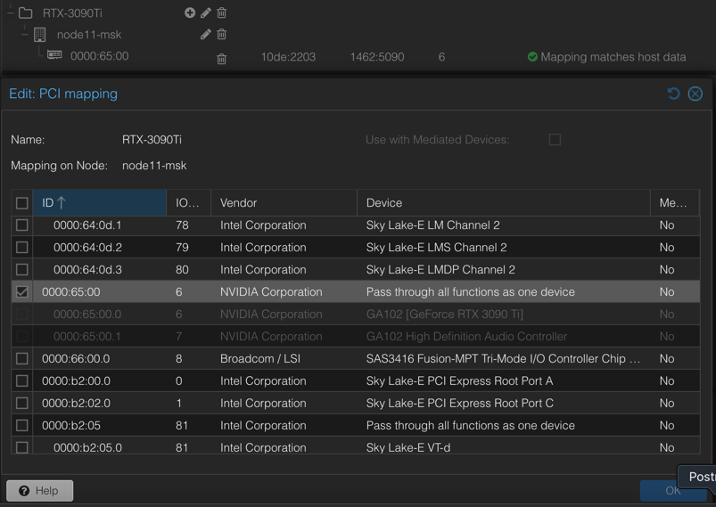
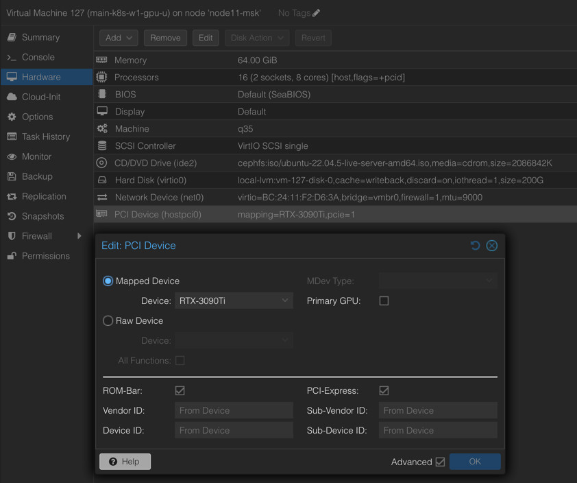

## Часть 1: Настройка GPU и Проброс в Proxmox

В этом разделе мы разберём, как подготовить виртуальные машины (VM) для будущего Kubernetes-кластера и предоставить им прямой доступ к видеокартам (GPU) через технологию PCI passthrough. Это позволит эффективно использовать ресурсы GPU в виртуализированной среде и даст основу для последующих шагов по распределённому инференсу.

---

### 1. Настройка GRUB

Для включения IOMMU и корректного проброса PCI-E устройств отредактируйте загрузчик GRUB:

1. Откройте файл `/etc/default/grub`.
2. В строке `GRUB_CMDLINE_LINUX_DEFAULT` добавьте параметры:
```bash
   intel_iommu=on iommu=pt pcie_acs_override=downstream,multifunction
```
Пример:

 ```bash
GRUB_CMDLINE_LINUX_DEFAULT="quiet intel_iommu=on iommu=pt pcie_acs_override=downstream,multifunction"
```

Сохраните изменения и обновите загрузчик:
 ```bash
update-grub
```
### 2. Поиск и проверка GPU

Просмотрите все PCI-устройства:
```bash
lspci
```
Найдите нужную видеокарту, например по адресу 65:00, и определите её идентификаторы:
```bash
lspci -n -s 65:00
```
Вывод в моем случае:
```
65:00.0 0300: 10de:2203 (rev a1)
65:00.1 0403: 10de:1aef (rev a1)
```

### 3. Блокировка конфликтующих драйверов

Чтобы стандартные драйверы не перехватывали управление GPU, внесите их в «чёрный список»:

1. Откройте `/etc/modprobe.d/blacklist.conf`.
2. Добавьте строки:
```
blacklist radeon
blacklist nouveau
blacklist nvidia
blacklist nvidiafb
```

### 4. Загрузка необходимых модулей

Укажите модули ядра, требуемые для VFIO, в файле `/etc/modules`:
```
vfio
vfio_iommu_type1
vfio_pci
vfio_virqfd
```
### 5. Настройка VFIO

Создайте или отредактируйте `/etc/modprobe.d/vfio.conf`.  
Добавьте строку с идентификаторами ваших устройств (из шага 2):
```
options vfio-pci ids=10de:2203,10de:1aef
```
### 6. Обновление initramfs

Примените изменения, обновив initramfs:
```bash
update-initramfs -u -k all
```

### 7. Перезагрузка сервера

Перезагрузите систему, чтобы применить новые настройки:
```bash
reboot
```

---

### 8. Маппинг GPU в интерфейсе Proxmox

В веб-интерфейсе Proxmox перейдите в `Datacenter → Resource Mapping`.  
Найдите нужное PCI-устройство (GPU) и выполните маппинг согласно подсказкам в интерфейсе.


---

### 9. Добавление GPU к виртуальной машине

В настройках виртуальной машины откройте раздел `Hardware`.  
Выберите `Add → PCI Device` и укажите свою видеокарту, которую вы ранее замапили.  



### 10. Использование Ubuntu 22.04

Для развёртывания Kubernetes-кластера внутри виртуальных машин рекомендован образ \*\*Ubuntu 22.04\*\* — он стабилен и хорошо поддерживает современные драйверы.

---

### 11. Подготовка узлов для Kubernetes с Deckhouse

Для создания кластера Kubernetes с использованием Deckhouse следуйте инструкциям из [официальной документации](https://deckhouse.io/). Там же описана интеграция узлов с GPU.

---

### Итог

- Proxmox настроен на проброс GPU в виртуальные машины (PCI passthrough).
- Виртуальные машины могут использовать мощность видеокарт напрямую.
- Базовые условия для дальнейшего развёртывания распределённого инференса (с Ray Serve, vLLM и т. д.) выполнены.
