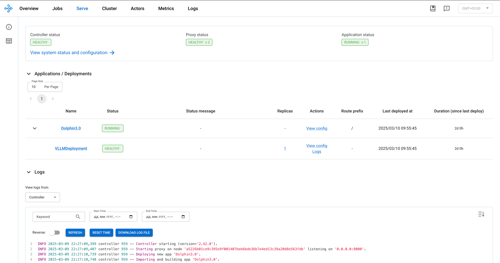
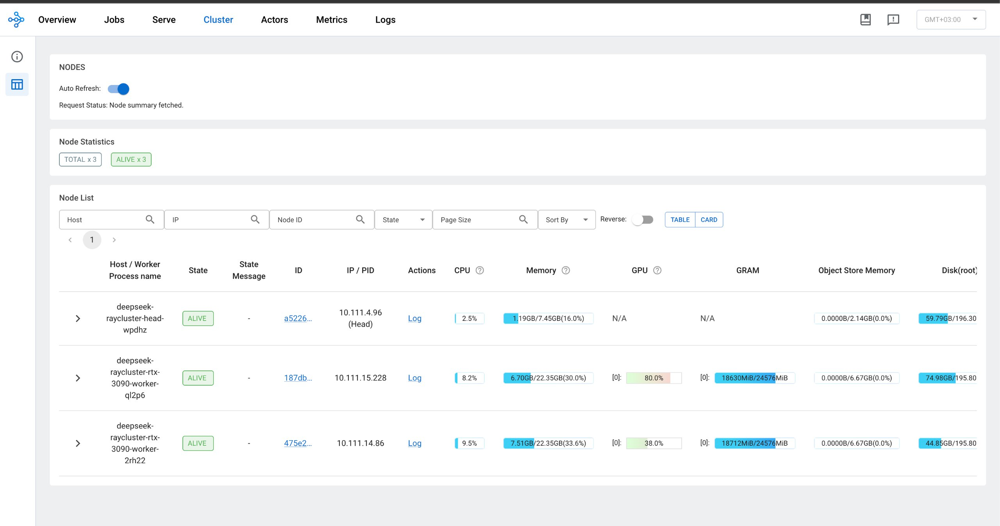
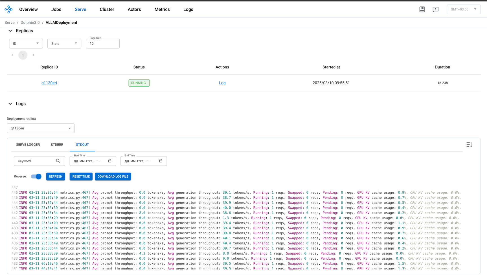

# Часть 4: Настройка KubeRay Cluster

В этом разделе мы разберёмся, как подготовить Docker-образ, поместить его в Registry и развернуть Ray Cluster с нужными параметрами —
чтобы организовать распределённый инференс, использовать CephFS (или другое хранилище), настраивать CPU/GPU-ресурсы и т.д.

-----------------------------------------------------------------------------

## Подготовка Docker-образа и загрузка в Registry

1. **Базовый образ Ray**
   Обычно берём официальный образ Ray, соответствующий версии — например, `rayproject/ray:2.42.0-py310-cu121`.
   Он уже содержит нужные компоненты Ray, CUDA-библиотеки и Python 3.10.
#
2. **Добавляем скрипты и пакеты**
   - Помещаем `serve.py`, `auth.py` (или всё в zip-архив).
   - Устанавливаем `vLLM`, `httpx`, `PyJWT` и любые другие зависимости.
#
3. **Сборка**
   - Пишем Dockerfile ([dockerfile.ray](ray-serve-vllm/dockerfile.ray)), в котором описываем добавление zip-файла и установку pip-зависимостей.
   - Собираем образ с помощью Make ([Makefile](ray-serve-vllm/Makefile)) командой:
     ```bash
     make package-container
     ```
#
4. **Загрузка образа**
   - Пушим результат в нужный Registry (DockerHub, GitLab Registry и т.п.):
     ```bash
     docker push gitlab.example.com:5050/it-operations/k8s-config/vllm-0.6.5-ray-2.42.0-py310-cu121-serve:1.1.2
     ```
   - Убеждаемся, что Kubernetes-узлы (или кластер) имеют доступ к этому Registry.

-----------------------------------------------------------------------------

## Настройка KubeRay cluster

Для удобства описываем Ray Cluster с помощью Helm-чарта и values-файла.
Основная идея:
- **head** (головной узел): содержит Ray Head Pod с установленным Ray Dashboard, Autoscaler (если нужен) и обеспечивает взаимодействие с Worker'ами.
- **worker**: 1+ Pod'ов, каждый из которых может работать на CPU или GPU.
- **additionalWorkerGroups**: дополнительные группы Worker'ов с другими конфигурациями (например, меньше памяти, более слабый GPU).

Ниже приведён пример [ap-values.yaml](argo-projects/kube-ray/charts/ray-cluster/ap-values.yaml), с основными настройками.

### 1. image

```yaml
image:
  repository: gitlab.example.com:5050/it-operations/k8s-config/vllm-0.6.5-ray-2.42.0-py310-cu121-serve
  tag: 1.1.2
  pullPolicy: IfNotPresent
```
- **repository** и **tag** — Docker-образ, который мы собрали на предыдущем шаге.
- **pullPolicy**: `IfNotPresent` означает, что Kubernetes не будет заново скачивать образ, если он уже есть локально.

### 2. imagePullSecrets

```yaml
imagePullSecrets:
  - name: regcred
```
- Если Registry приватный, нужно прописать секрет (credential).

### 3. common

```yaml
common:
  containerEnv:
    - name: HF_HOME
      value: "/data/model-cache"
    - name: DTYPE
      value: "float16"
    - name: GPU_MEMORY_UTIL
      value: "0.97"
    - name: MAX_MODEL_LEN
      value: "32768"
```
- **containerEnv** задаёт переменные окружения, которые попадут и в Head, и в Worker.
  - `DTYPE` (например, float16) — тип данных при инференсе.
  - `GPU_MEMORY_UTIL` — доля видеопамяти, которую можно занимать при работе vLLM.
  - `MAX_MODEL_LEN` — максимально допустимая длина токенов для модели (по необходимости).

### 4. head

```yaml
head:
  rayVersion: "2.42.0"
  labels:
    component: ray-head
  serviceAccountName: "sa-deepseek-cluster"
  rayStartParams:
    dashboard-host: "0.0.0.0"
    num-cpus: "0"
    metrics-export-port: "8080"
  containerEnv:
    - name: RAY_GRAFANA_HOST
      value: https://prometheus.d8-monitoring:9090
  envFrom:
    - secretRef:
        name: auth-config
  resources:
    limits:
      cpu: "6"
      memory: "8G"
    requests:
      cpu: "3"
      memory: "4G"
  volumes:
    - name: model-cache
      persistentVolumeClaim:
        claimName: model-cache-pvc
  volumeMounts:
    - mountPath: /data/model-cache
      name: model-cache
```
- **rayVersion** — указывает, какая версия Ray используется Autoscaler'ом (если включён in-tree Autoscaling).
- **serviceAccountName** — ServiceAccount, который нужно дать Pod'у (может понадобиться для доступа к PV, Secret и т.д.).
- **envFrom** — берём переменные из Secret `auth-config` (логины, пароли, JWT-ключи).
- **resources** — запросы и лимиты CPU/RAM для Head Pod'а (пример: лимит 6 CPU / 8GiB RAM).
- **volumes / volumeMounts** — примонтированный CephFS (через PVC `model-cache-pvc`) на путь `/data/model-cache`, чтобы модель была доступна для head.

### 5. worker

```yaml
worker:
  groupName: rtx-3090
  replicas: 2
  minReplicas: 2
  maxReplicas: 2
  resources:
    limits:
      cpu: "16"
      memory: "24G"
      nvidia.com/gpu: "1"
    requests:
      cpu: "8"
      memory: "12G"
      nvidia.com/gpu: "1"
  nodeSelector:
    node.deckhouse.io/group: "w-gpu"
  tolerations:
    - key: "dedicated.apiac.ru"
      operator: "Equal"
      value: "w-gpu"
      effect: "NoExecute"
  volumes:
    - name: model-cache
      persistentVolumeClaim:
        claimName: model-cache-pvc
  volumeMounts:
    - mountPath: /data/model-cache
      name: model-cache
```
- **groupName** — название группы worker'ов (rtx-3090).
- **replicas** и **minReplicas/maxReplicas** — сколько Pod'ов worker будет по умолчанию и какой допускается диапазон.
- **resources** — лимиты CPU/Memory и GPU (например, 1 карта на Pod).
- **nodeSelector** и **tolerations** — размещаем worker'ы на узлах с лейблом `node.deckhouse.io/group=w-gpu`.
- **volumes / volumeMounts** — аналогично head, монтируем PVC для общей модели.

### 6. additionalWorkerGroups

```yaml
additionalWorkerGroups:
  rtx-3060:
    disabled: true
    replicas: 1
    minReplicas: 1
    maxReplicas: 1
    nodeSelector:
      node.deckhouse.io/group: "w-gpu-3060"
    ...
```
- Можно добавить сколько угодно дополнительных групп, каждая со своими ресурсами, лейблами, affinities и т.д.
- Ставим `disabled: true` в примере, если пока не хотим их запускать.

-----------------------------------------------------------------------------

## Развёртывание Ray Application. Запуск модели Dolphin3.0 и тестирование API

В данном разделе мы описываем, как выбрать и запустить модель **Dolphin3.0** (доступна на [Hugging Face](https://huggingface.co/)) в Ray-кластере,
а также проверяем, как работает наш OpenAI-совместимый эндпоинт с JWT-аутентификацией.

-----------------------------------------------------------------------------


# Запуск модели Dolphin3.0 через Ray Application

Для запуска модели **Dolphin3.0** (доступна по адресу [Valdemardi/Dolphin3.0-R1-Mistral-24B-AWQ](https://huggingface.co/Valdemardi/Dolphin3.0-R1-Mistral-24B-AWQ)) в Ray-кластере мы используем **Ray Application**.
Данный механизм указывает Ray Serve, какие файлы брать, какую модель загружать и под какими настройками параллелизации (tensor/pipeline) работать.

-----------------------------------------------------------------------------

## Пример JSON-запроса к Ray Dashboard

Отправляем POST-запрос на `https://ray-dashboard.k8s.example.com/api/serve/applications/` с телом:

```json
{
  "applications": [
    {
      "import_path": "serve:model",
      "name": "Dolphin3.0",
      "route_prefix": "/",
      "autoscaling_config": {
        "min_replicas": 1,
        "initial_replicas": 1,
        "max_replicas": 1
      },
      "deployments": [
        {
          "name": "VLLMDeployment",
          "num_replicas": 1,
          "ray_actor_options": {},
          "deployment_ready_timeout_s": 1200
        }
      ],
      "runtime_env": {
        "working_dir": "file:///home/ray/serve.zip",
        "env_vars": {
          "MODEL_ID": "Valdemardi/Dolphin3.0-R1-Mistral-24B-AWQ",
          "TENSOR_PARALLELISM": "1", 
          "PIPELINE_PARALLELISM": "2",
          "MODEL_NAME": "Dolphin3.0"
        }
      }
    }
  ]
}
```

### Ключевые моменты

1. **import_path**: `"serve:model"`
   - Указывает Ray, что в архиве (working_dir) находится Python-модуль `serve.py`, в котором определён объект `model`.
   - Именно он разворачивается как Ray Serve Deployment.

2. **name**: `"Dolphin3.0"`
   - Имя приложения в Ray Dashboard, чтобы легко отличать его от других.

3. **route_prefix**: `"/"`
   - Базовый путь, по которому будет доступен сервис (при наличии Ingress или сервисов).

4. **autoscaling_config**
   - min_replicas, initial_replicas, max_replicas задают политику масштабирования. В примере — 1 реплика (без автоскейла).

5. **deployments**
   - Здесь описан `VLLMDeployment` с num_replicas = 1. Это класс/обёртка vLLM в `serve.py`.
   - `deployment_ready_timeout_s = 1200` даёт время (20 минут) на инициализацию модели (полезно при больших загрузках).

6. **runtime_env**
   - `working_dir: "file:///home/ray/serve.zip"` говорит Ray, где лежит код (скрипты `serve.py`, `auth.py`).
   - `env_vars`: задаём переменные окружения для vLLM:
     - `"MODEL_ID"`: название модели на Hugging Face — здесь "Valdemardi/Dolphin3.0-R1-Mistral-24B-AWQ".
     - `"TENSOR_PARALLELISM"` и `"PIPELINE_PARALLELISM"`: регламентируют шардирование и конвейерную параллельность.
       - "TENSOR_PARALLELISM": "1" - на каждой ноде 1 GPU
       - "PIPELINE_PARALLELISM": "2" - 2 GPU всего в кластере
     - `"MODEL_NAME"`: отображается в ответах API как название модели.

-----------------------------------------------------------------------------

## Результат деплоя и вид в Ray Dashboard

После успешного запроса Ray:
1. Извлекает файлы из `serve.zip` и создаёт Ray Serve Application под именем «Dolphin3.0».
2. В разделе Deployments появляется `VLLMDeployment`. vLLM инициализируется, подгружая Dolphin3.0 из Hugging Face.
3. При желании можно просмотреть логи, где будет видно, как vLLM скачивает вес модели и запускает инференс.

С этого момента **модель Dolphin3.0 готова к приёму запросов** на OpenAI-совместимые эндпоинты (например, `/v1/chat/completions`),
используя конфигурацию параллелизации (tensor/pipeline), указанную в env_vars.



-----------------------------------------------------------------------------

## Тестирование API и аутентификации

1. **Создание пользователей**
   - В Kubernetes создаём `Secret` ([auth.yaml](ray-serve-vllm/auth.yaml)) с JWT-ключом, параметрами истечения токена, а также списком пользователей
     (логины, роли, хэши паролей).

   Пример `auth.yaml`:
   ```yaml
   apiVersion: v1
   kind: Secret
   metadata:
     name: auth-config
     namespace: kuberay-projects
   type: Opaque
   data:
     JWT_KEY: ZGVmYXVsdF9qd3RfS2V5
     ACCESS_TOKEN_EXPIRE_MINUTES: NjA=
     SKIP_EXP_CHECK: ZmFsc2U=
     HUGGING_FACE_HUB_TOKEN: ""
     USER_LIST: QUxJQ0UsIEJPQg==
     ALICE_USERNAME: YWxpY2U=
     ALICE_HASHED_PASSWORD: ZmFrZWhhc2hlZGhhc2g=
     ALICE_ROLE: YWRtaW4=
     BOB_USERNAME: Ym9i
     BOB_HASHED_PASSWORD: ZmFrZWhhc2hlZGhhc2g=
     BOB_ROLE: Z3Vlc3Q=
   ```
   - В переменных окружения `ALICE_HASHED_PASSWORD` и т.д. хранится уже «соль+хэш» пароля (см. пример кода ниже).

2. **Генерация пароля и хэша**
   - Используем Python-скрипт [gen_pwd.py](ray-serve-vllm/gen_pwd.py), где с помощью `secrets.token_hex` и `hashlib.sha256` вычисляем соли и хэши паролей.
   - Затем записываем в Secret, чтобы `auth.py` мог сравнивать введённые данные при аутентификации.

3. **Авторизация и получение JWT**
   - Выполняем запрос на `/token`, передавая `username` / `password` в формате `form-data`:
     ```bash
     curl --location 'https://openai-api.example.com/token' \
       --form 'username="admin"' \
       --form 'password="password"'
     ```
   - В ответ:
     ```json
     {
       "access_token": "<токен>",
       "token_type": "bearer"
     }
     ```

4. **Вызов инференса**
   Теперь пробуем вызвать через API сам инференс (задав один из самых сложных вопросов во вселенной):

   ```bash
   curl --location 'https://openai-api.example.com/v1/chat/completions' \
   --header 'Content-Type: application/json' \
   --header 'Authorization: Bearer <токен>' \
   --data '{
     "model": "Dolphin3.0",
     "messages": [
       {
         "role": "user",
         "content": "Сколько четвергов в марте 2025 года?"
       }
     ],
     "stream": false,
     "max_tokens": 2000,
     "temperature": 0.85,
     "top_p": 0.95,
     "top_k": 50,
     "repetition_penalty": 1.0
   }'
   ```

5. **Получаем ответ (по которому видим, что даже ИИ еще не способен знать всё, но в этот раз он хотя бы посчитал правильное количество):**
   ```json
   {
     "id": "chatcmpl-83b78eaa98155738c8c6c77b95d9bc10",
     "object": "chat.completion",
     "created": 1741762050,
     "model": "Dolphin3.0",
     "choices": [
         {
             "index": 0,
             "message": {
                 "role": "assistant",
                 "content": "В 2025 году Март будет иметь 31 день, как и в любом году. Чтобы определить количество четвергов в марте 2025 года, нам нужно узнать, на какой день падает начало каждого месяца и на какой день - начало следующего месяца.\n\nТак как 1 марта 2025 года попадает на среду, то первое повышение будет с субботы (4 марта) по вторник (7 марта). Таким образом, первый четверг будет с 4 по 7 марта.\n\nТеперь посчитаем количество дней во втором месяце (с 8 по 31 марта), чтобы выяснить, сколько полных четвертов будет в этом периоде. Всего в марте 2025 года будет 31 день, и если мы исключим первые 7 дней, то останется 24 дня. Количество полных недельных циклов в 24 днях составляет 3 полные недели (21 день) с двумя дополнительными днями. Таким образом, будет ещё 3 полных четверта в конце месяца.\n\nИтого у нас будет 1 (с 4 по 7 марта) + 3 (с 11 по 14 марта, 18 по 21 марта, 25 по 28 марта) = 4 четверга в марте 2025 года. Остатки не составляют четверга, так как после 28 марта остаётся меньше 7 дней до конца месяца, а 31 марта приходится на пятницу.",
                 "tool_calls": []
             },
             "finish_reason": "stop"
         }
     ],
     "usage": {
         "prompt_tokens": 23,
         "total_tokens": 366,
         "completion_tokens": 343
     }
   }
   ```
-----------------------------------------------------------------------------

## Мониторинг в Ray Dashboard

- В Ray Dashboard видим загруженность GPU (скорость ~40 token/s, в зависимости от конкретной модели и конфигурации).
- Логи отображают процесс инференса, можно анализировать ошибки или задержки.





-----------------------------------------

## Итог
#
1. **Успешно подключили Dolphin3.0** из Hugging Face, развернув её в Ray-кластере (vLLM под капотом).
2. **API** `/v1/chat/completions` проверено — оно выдаёт JSON-ответ, совместимый с OpenAI-протоколом.
3. **JWT-аутентификация** ограничивает доступ к этому эндпоинту, пользователи хранятся в Secret.
4. В **Ray Dashboard** наблюдаем показатели нагрузки и состояние приложения, подтверждая корректную работу инференса.

API протестировали - давайте теперь подключим удобный интерфейс.
