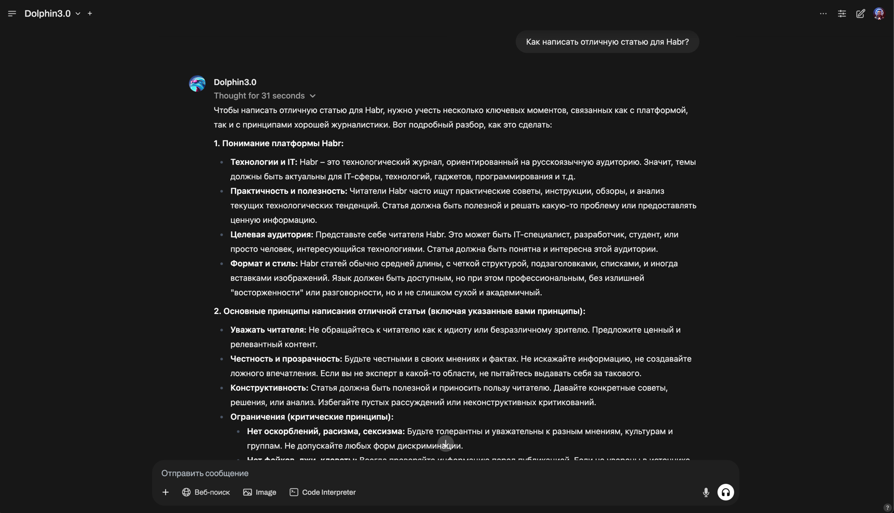

# Часть 5: Настройка авторизации и интеграция с OpenWebUI

В этом разделе мы рассмотрим, как развернуть **OpenWebUI** – бесплатный веб-интерфейс для взаимодействия с LLM, подробно разберём его основные возможности и настройки, а также покажем, как связать OpenWebUI с нашим Ray-кластером, чтобы общаться с моделью через OpenAI-совместимый API.

---

## 1. Обзор OpenWebUI
 Репозиторий и подробности:  
 [https://github.com/open-webui/open-webui](https://github.com/open-webui/open-webui)

### 1.1 Общие сведения

**OpenWebUI** – это веб-приложение, упрощающее работу с большими языковыми моделями (LLM). Благодаря нему пользователи могут:
- **Отправлять сообщения** к модели (в формате диалога),
- **Сохранять** сессии диалога, чтобы возвращаться к ним и продолжать,
- **Настраивать** параметры инференса (температуру, длину вывода, top_k, top_p и др.),
- **Управлять пользователями и ролями** (регистрация, назначение роли admin/user).

Поддерживаются различные **бэкенды** для обработки запросов:
- **Ray Serve** (через OpenAI-совместимый эндпоинт),
- **Ollama** (локальные модели),
- **Внешние OpenAI API** (официальный OpenAI, Azure, Anthropic и пр.),
- **Pipelines** (экспериментальные функции с LangChain и т.д.).

### 1.2 Особенности и расширения

1. **Бесплатная лицензия** – Проект распространяется бесплатно (MIT), открытый код.
2. **Модульность** – Можно активировать плагины (например, Pipelines) для дополнительного функционала:
   - Загрузка и обработка PDF, DOCX и прочих документов (через Tika),
   - Интеграция c Langfuse, поддержка RAG (Retrieval Augmented Generation).
3. **WebSocket** – Поддерживает двустороннюю коммуникацию реального времени, что нужно для «стримингового» ответа модели.
4. **Мульти-сессии** – Пользователи могут вести несколько параллельных диалогов с разными моделями.

---

## 2. Развёртывание OpenWebUI через Helm

### 2.1 Основной Helm-чарт

OpenWebUI предлагает официальный Helm-чарт, позволяющий:
- Запускать **StatefulSet** или **Deployment** (на выбор) с несколькими репликами,
- Настраивать **Ingress**, **Redis** (для WebSocket), **PVC** (хранение данных), **авторизацию** и т.д.

Пример установки:
```bash
helm repo add open-webui https://helm.openwebui.io
helm install open-webui open-webui/open-webui -f ap-values.yaml
```
где [ap-values.yaml](argo-projects/kube-ray/charts/open-webui/ap-values.yaml) – пример моих настроек.

Основные параметры:

```yaml
nameOverride: "web-ui"

# ollama, pipelines, tika — опциональные модули, обычно отключены, если не нужны
ollama:
  enabled: false
pipelines:
  enabled: false
tika:
  enabled: false

# Может использоваться встроенный Redis для WebSocket
websocket:
  enabled: true
  manager: redis
  redis:
    enabled: true

# Глобальный Redis-кластер (можно отключить или настроить внешний)
redis-cluster:
  enabled: true
  fullnameOverride: open-webui-redis
  auth:
    enabled: false
  replica:
    replicaCount: 3

# Настройки реплик OpenWebUI
replicaCount: 2
image:
  repository: ghcr.io/open-webui/open-webui
  tag: ""
  pullPolicy: "IfNotPresent"

# Ингресс, используемый для доступа извне
ingress:
  enabled: true
  class: "external-ingress"
  annotations:
    cert-manager.io/cluster-issuer: regru-letsencrypt-prod
    nginx.ingress.kubernetes.io/websocket-services: "web-ui"
  host: "ai.example.com"
  tls: true
  existingSecret: "ai-example-com-https-cert"

# Хранилище
persistence:
  enabled: true
  size: 10Gi
  accessModes:
    - ReadWriteMany
  storageClass: "ceph-fs-nvme-sc"

# Ключевая переменная — куда «проксировать» OpenAI API
openaiBaseApiUrl: "https://openai-api.example.com/v1"
openaiBaseApiUrls:
  - "https://openai-api.example.com/v1"

extraEnvVars:
  - name: ENABLE_OPENAI_API
    value: "True"
  - name: DEFAULT_MODELS
    value: "Dolphin3.0"
  - name: WEBUI_NAME
    value: "AI.example.com"
  - name: WEBUI_URL
    value: "https://ai.example.com"
  - name: DEFAULT_LOCALE
    value: "ru"
  - name: RAG_EMBEDDING_ENGINE
    value: "openai"
  - name: ENABLE_LOGIN_FORM
    value: "True"
  - name: OPENAI_API_KEY
    valueFrom:
      secretKeyRef:
        name: openai-api-key
        key: api-key
```


### Настройки Ingress

- **host**: `ai.example.com` — имя домена, с которого будет доступен интерфейс.
- **annotations**: можно указать аннотации для автоматического получения TLS-сертификата через cert-manager (например, `cert-manager.io/cluster-issuer: regru-letsencrypt-prod`).
- **class**: `external-ingress`, если используете свой внешний Ingress.

### Провайдер Let's Encrypt для Regru

У меня хостинг regru и для Let's Encrypt сертификатов я использую DNS01-Challenge а помогает мне в этом webhook для certmanager от ребят из Фланта [regru-letsencrypt-prod](https://github.com/flant/cert-manager-webhook-regru)
Для его работы необходимо добавить соответствующие аннотации и создать `ClusterIssuer`, который будет взаимодействовать с regru API для получения сертификатов.

### Параметры окружения (extraEnvVars)

- **ENABLE_OPENAI_API**: `True`, чтобы включить работу OpenWebUI с OpenAI-протоколами.
- **DEFAULT_MODELS**: указываем «Dolphin3.0» как модель «по умолчанию» на интерфейсе.
- **WEBUI_URL**: внешний URL, чтобы ссылки и формы корректно формировались.
- **OPENAI_API_KEY**: если требуется ключ, который OpenWebUI будет передавать при работе с внешним OpenAI API (или вашим Ray API).

Полный список переменных окружения:
[https://docs.openwebui.com/getting-started/env-configuration/](https://docs.openwebui.com/getting-started/env-configuration/)


## 3. Интерфейс и основные блоки

### 3.1 Настройки модели

При первом запуске OpenWebUI (допустим, `https://ai.example.com`), вы увидите:
- **Главный экран** со списком чатов,
- **Настройки** (Settings), где задаётся:
  - **Base URL** для OpenAI-протокола (`openaiBaseApiUrl` или несколько в `openaiBaseApiUrls`),
  - **Модель по умолчанию**,
  - **API ключ** (если требуется).
Вот экран с настройками модели где мы задаем URL до нашего API и ключ к нему


### 3.2 Создание диалога

Пользователь кликает «New Chat», выбирает модель, задаёт системное сообщение (System Prompt), после чего общается с LLM в режиме реального времени. OpenWebUI:
- Отправляет запрос на `POST /v1/chat/completions`,
- Получает стриминг-ответ (если включена функция stream).

### 3.3 Сохранение истории

OpenWebUI хранит диалоги в своей базе данных (по умолчанию SQLite внутри контейнера или на PVC). Пользователи могут:
- Переключаться между чатами,
- Возвращаться к старым чатам, продолжать или просматривать их.

---

## 4. Управление пользователями и ролями

### 4.1 Роль Admin

При развёртывании можно назначить (либо создать при первом запуске) учётную запись администратора, имеющую права:
- Подтверждать регистрацию других пользователей,
- Назначать им роли (user, admin, guest),
- Настраивать общие параметры приложения.

### 4.2 Регистрация

Если `ENABLE_LOGIN_FORM=true`, тогда гости могут зайти на страницу /login и:
1. Зарегистрироваться (вводя email, пароль).
2. Сразу попадают в статус **Pending**.
3. Админ их активирует.

Это позволяет разграничить доступ к инференсу, так как LLM-вычисления дорого обходятся по ресурсам.

---

## 5. Пример инференса

1. **OpenWebUI** развёрнут с `ingress.host=ai.example.com`.
2. **Ray Serve** (с моделью `Dolphin3.0`) доступен по `https://openai-api.example.com/v1`.
3. **В настройках** OpenWebUI (или в `ap-values.yaml`) прописали:
   ```yaml
   openaiBaseApiUrl: "https://openai-api.example.com/v1"
   extraEnvVars:
     - name: DEFAULT_MODELS
       value: "Dolphin3.0"
   ```
4. **Авторизация**: проходим логин в OpenWebUI (админ или обычный пользователь).
5. **Выбираем** модель Dolphin3.0, задаём вопрос:



6. **Получаем** ответ, который приходит из Ray Serve (vLLM).

---

## 6. Дополнительные возможности

1. **LangChain Pipelines** – Можно активировать `pipelines.enabled=true` и подключать LangChain, Tika, инструменты для анализа документов.
2. **Ollama** – Если требуется локальный бэкенд Ollama, можно включить `ollama.enabled=true`. Но в нашем случае используется Ray Serve.
3. **Redis cluster** – При больших нагрузках лучше включить Redis Cluster (replicaCount > 3), чтобы WebSocket-соединения хранились надёжно.

---

## 7. Вывод приложения в интернет и защита с помощью CDN

### 7.1 Зачем нужен CDN

**Content Delivery Network** (CDN) располагает точками присутствия (POP) по всему миру. Когда пользователи обращаются к вашему домену (например, `ai.example.com`):
1. Запрос идёт через CDN, который может:
   - Арендовать каналы и маршрутизировать трафик по более коротким путям.
   - Защищать от **DDoS**-атак (особенно L3/L4 уровень).
   - Скрываться как «прокси», не раскрывая реального IP вашего кластера.
2. Поддержка **WebSocket** (важно для OpenWebUI, где чат может работать в реальном времени).

**EdgeCenter** (пример сервиса CDN [EdgeCenter](https://edgecenter.ru/cdn)) предоставляет:
- Роутинг трафика и кэш (пригодится, если есть статические компоненты).
- Вариант **WAF**-модуля, защищающего от классических web-атак (OWASP Top 10).
- Настройки гео-блокировки (например, запретить доступ из конкретных регионов).

### 7.2 Как это работает

1. **Настраиваем DNS**:
   - Доменное имя `ai.example.com` указывает на CDN (A/CNAME-запись).
2. **Настраиваем CDN-конфигурацию**:
   - Указываем backend-адрес (`<LoadBalancer IP>` или `<Ingress IP>` вашего кластера).
   - Включаем **WebSocket** pass-through, чтобы чат работал.
   - Активируем **WAF**, чтобы фильтровать вредоносные запросы.
3. **CDN + TLS**:
   - CDN может взять на себя создание TLS-сертификатов.
   - При этом внешний мир видит IP CDN, а не ваш кластер.

### 7.3 Преимущества

1. **Сокрытие реального IP**: усложняет атаки на прямой адрес.
2. **Защита от DDoS**: CDN провайдер может отсеивать интенсивный нежелательный трафик.
3. **WAF**: блокирует SQL-инъекции, XSS, и другие угрозы из топ-10 OWASP.
4. **Контроль**: некоторые CDN/WAF решения дают гибкие правила (Rate Limiting, гео-блок, ограничения по User-Agent).

---
## 8. Итог

1. **OpenWebUI** даёт удобный UI для GPT-подобных моделей, поддерживает OpenAI-стиль запросов, сохраняет чаты, имеет встроенную авторизацию.
2. **Настройки** (через Helm) позволяют масштабировать количество реплик, подключать разные модули, настраивать TLS и persistence.
3. **Гибкая авторизация** (роль admin, pending users) и возможность дополнительно использовать JWT на стороне Ray Serve (двойная защита).
4. **CDN и WAF** помогают безопасно публиковать интерфейс наружу, скрывая IP кластера, фильтруя вредоносные запросы.
