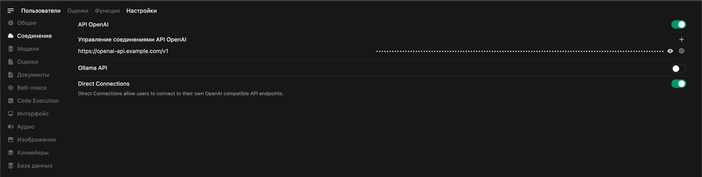

#### Часть 5: Настройка авторизации и интеграция с OpenWebUI
- **Интеграция с OpenWebUI**: Разворачивание OpenWebUI в качестве интерфейса взаимодействия с LLM и его настройкой с Ray Application API.

Рассказ про OpenWebUI и для чего он нужен а так же что умеет (важно сказать что он бесплатный) - https://github.com/open-webui/open-webui

Устанавливаем его с помощью helm чарта, говорим что там очень много настроек и проходимся по основным, говорим где настроить API и какие еще есть настройки

ap-values.yaml

nameOverride: "web-ui"
namespaceOverride: ""

ollama:
  # -- Automatically install Ollama Helm chart from https://otwld.github.io/ollama-helm/. Use [Helm Values](https://github.com/otwld/ollama-helm/#helm-values) to configure
  enabled: false
  # -- If enabling embedded Ollama, update fullnameOverride to your desired Ollama name value, or else it will use the default ollama.name value from the Ollama chart
  fullnameOverride: "open-webui-ollama"
  # -- Example Ollama configuration with nvidia GPU enabled, automatically downloading a model, and deploying a PVC for model persistence
  # ollama:
  #   gpu:
  #     enabled: true
  #     type: 'nvidia'
  #     number: 1
  #   models:
  #     pull:
  #       - llama3
  #     run:
  #       - llama3
  # runtimeClassName: nvidia
  # persistentVolume:
  #   enabled: true
  #   volumeName: "example-pre-existing-pv-created-by-smb-csi"

pipelines:
  # -- Automatically install Pipelines chart to extend Open WebUI functionality using Pipelines: https://github.com/open-webui/pipelines
  enabled: false
  # -- This section can be used to pass required environment variables to your pipelines (e.g. Langfuse hostname)
  extraEnvVars: []

tika:
  # -- Automatically install Apache Tika to extend Open WebUI
  enabled: false

# -- A list of Ollama API endpoints. These can be added in lieu of automatically installing the Ollama Helm chart, or in addition to it.
ollamaUrls: []

# -- Disables taking Ollama Urls from `ollamaUrls`  list
ollamaUrlsFromExtraEnv: false

websocket:
  # -- Enables websocket support in Open WebUI with env `ENABLE_WEBSOCKET_SUPPORT`
  enabled: true
  # -- Specifies the websocket manager to use with env `WEBSOCKET_MANAGER`: redis (default)
  manager: redis
  # -- Specifies the URL of the Redis instance for websocket communication. Template with `redis://[:<password>@]<hostname>:<port>/<db>`
  url: redis://open-webui-redis:6379/0
  # -- Deploys a redis
  redis:
    # -- Enable redis installation
    enabled: true
    # -- Redis name
    name: open-webui-redis
    # -- Redis labels
    labels: {}
    # -- Redis annotations
    annotations: {}
    # -- Redis pod
    pods:
      # -- Redis pod annotations
      annotations: {}
    # -- Redis image
    image:
      repository: redis
      tag: 7.4.2-alpine3.21
      pullPolicy: IfNotPresent
    # -- Redis command (overrides default)
    command: []
    # -- Redis arguments (overrides default)
    args: []
    # -- Redis resources
    resources: {}
    # -- Redis service
    service:
      # -- Redis container/target port
      containerPort: 6379
      # -- Redis service type
      type: ClusterIP
      # -- Redis service labels
      labels: {}
      # -- Redis service annotations
      annotations: {}
      # -- Redis service port
      port: 6379
      # -- Redis service node port. Valid only when type is `NodePort`
      nodePort: ""
    # -- Redis tolerations for pod assignment
    tolerations: []

    # -- Redis affinity for pod assignment
    affinity: {}

# -- Deploys a Redis cluster with subchart 'redis' from bitnami
redis-cluster:
  # -- Enable Redis installation
  enabled: true
  # -- Redis cluster name (recommended to be 'open-webui-redis')
  # - In this case, redis url will be 'redis://open-webui-redis-master:6379/0' or 'redis://[:<password>@]open-webui-redis-master:6379/0'
  fullnameOverride: open-webui-redis
  # -- Redis Authentication
  auth:
    # -- Enable Redis authentication (disabled by default). For your security, we strongly suggest that you switch to 'auth.enabled=true'
    enabled: false
  # -- Replica configuration for the Redis cluster
  replica:
    # -- Number of Redis replica instances
    replicaCount: 3

# -- Value of cluster domain
clusterDomain: cluster.local

annotations: {}
podAnnotations: {}
podLabels:
  component: web-ui-ai
replicaCount: 2
# -- Strategy for updating the workload manager: deployment or statefulset
strategy: {}
# -- Open WebUI image tags can be found here: https://github.com/open-webui/open-webui
image:
  repository: ghcr.io/open-webui/open-webui
  tag: ""
  pullPolicy: "IfNotPresent"

serviceAccount:
  enable: true
  name: ""
  annotations: {}
  automountServiceAccountToken: false

# -- Configure imagePullSecrets to use private registry
# ref: <https://kubernetes.io/docs/tasks/configure-pod-container/pull-image-private-registry>
imagePullSecrets: []
# imagePullSecrets:
# - name: myRegistryKeySecretName

# -- Probe for liveness of the Open WebUI container
# ref: <https://kubernetes.io/docs/tasks/configure-pod-container/configure-liveness-readiness-startup-probes>
livenessProbe:
   httpGet:
     path: /health
     port: http
   failureThreshold: 1
   periodSeconds: 10

# -- Probe for readiness of the Open WebUI container
# ref: <https://kubernetes.io/docs/tasks/configure-pod-container/configure-liveness-readiness-startup-probes>
readinessProbe:
   httpGet:
     path: /health/db
     port: http
   failureThreshold: 1
   periodSeconds: 10

# -- Probe for startup of the Open WebUI container
# ref: <https://kubernetes.io/docs/tasks/configure-pod-container/configure-liveness-readiness-startup-probes>
startupProbe:
   httpGet:
     path: /health
     port: http
   initialDelaySeconds: 30
   periodSeconds: 5
   failureThreshold: 20

resources: {}

copyAppData:
  resources: {}

managedCertificate:
  enabled: false
  name: "mydomain-chat-cert"  # You can override this name if needed
  domains:
    - chat.example.com # update to your real domain

ingress:
  enabled: true
  class: "external-ingress"
  # -- Use appropriate annotations for your Ingress controller, e.g., for NGINX:
  # nginx.ingress.kubernetes.io/rewrite-target: /
  annotations:
    cert-manager.io/cluster-issuer: regru-letsencrypt-prod
#    cert-manager.io/cluster-issuer: inter-ca
    cert-manager.io/common-name: ai.example.com
#    cert-manager.io/duration: 8760h
    cert-manager.io/renew-before: 360h
    nginx.ingress.kubernetes.io/websocket-services: "web-ui"
    nginx.ingress.kubernetes.io/proxy-body-size: 40m
    nginx.ingress.kubernetes.io/affinity: "cookie"
    nginx.ingress.kubernetes.io/session-cookie-name: "kkstiky"
    nginx.ingress.kubernetes.io/session-cookie-expires: "172800"
    nginx.ingress.kubernetes.io/session-cookie-max-age: "172800"
    nginx.ingress.kubernetes.io/configuration-snippet: |
      more_set_headers "X-Forwarded-For $http_x_forwarded_for";
#    nginx.ingress.kubernetes.io/backend-protocol: "HTTP"
  host: "ai.example.com"
  additionalHosts: []
  tls: true
  existingSecret: "ai-example-com-https-cert"
persistence:
  enabled: true
  size: 10Gi
  # -- Use existingClaim if you want to re-use an existing Open WebUI PVC instead of creating a new one
  existingClaim: ""
  # -- Subdirectory of Open WebUI PVC to mount. Useful if root directory is not empty.
  subPath: ""
  # -- If using multiple replicas, you must update accessModes to ReadWriteMany
  accessModes:
    - ReadWriteMany
  storageClass: "ceph-fs-nvme-sc"
  selector: {}
  annotations: {}

# -- Node labels for pod assignment.
nodeSelector: {}

# -- Tolerations for pod assignment
tolerations: []

# -- Affinity for pod assignment
affinity:
  podAntiAffinity:
    requiredDuringSchedulingIgnoredDuringExecution:
      - labelSelector:
          matchExpressions:
            - key: component
              operator: In
              values: [ "web-ui-ai" ]
        topologyKey: "kubernetes.io/hostname"

# -- Topology Spread Constraints for pod assignment
topologySpreadConstraints: []

# -- Service values to expose Open WebUI pods to cluster
service:
  type: ClusterIP
  annotations: {}
  port: 80
  containerPort: 8080
  nodePort: ""
  labels: {}
  loadBalancerClass: ""

# -- OpenAI base API URL to use. Defaults to the Pipelines service endpoint when Pipelines are enabled, and "https://api.openai.com/v1" if Pipelines are not enabled and this value is blank
openaiBaseApiUrl: "https://openai-api.example.com/v1"

# -- OpenAI base API URLs to use. Overwrites the value in openaiBaseApiUrl if set
openaiBaseApiUrls:
  - "https://openai-api.example.com/v1"
# - "https://api.company.openai.com/v1"

# -- Env vars added to the Open WebUI deployment. Most up-to-date environment variables can be found here: https://docs.openwebui.com/getting-started/env-configuration/
extraEnvVars:
  - name: ENABLE_OPENAI_API
    value: "True"
  - name: DEFAULT_MODELS
    value: "Dolphin3.0"
  - name: WEBUI_NAME
    value: "AI.example.com"
  - name: WEBUI_URL
    value: "https://ai.example.com"
  - name: DEFAULT_LOCALE
    value: "ru"
  - name: WEBUI_BANNERS
    value: "[{\"id\": \"1\", \"type\": \"info\", \"title\": \"Your messages are stored.\", \"content\": \"Your messages are stored. LLM's are prone to hallucinations, check sources.\", \"dismissible\": true, \"timestamp\": 1000}]"
  - name: WEBUI_SESSION_COOKIE_SECURE
    value: "True"
  - name: WEBUI_AUTH_COOKIE_SECURE
    value: "True"
  - name: ENABLE_REALTIME_CHAT_SAVE
    value: "True"
  - name: RAG_EMBEDDING_ENGINE
    value: "openai"
  - name: ENABLE_LOGIN_FORM
    value: "True"
  - name: CHUNK_SIZE
    value: "2000"
  - name: REQUESTS_CA_BUNDLE
    value: "/etc/ssl/certs/ca-certificates.crt"
  # URL вашего backend-сервиса Ray Serve (замените ray-head-service на актуальное имя/адрес)
  # Имя модели, используемой в запросах
  # valueFrom:
  #   secretKeyRef:
  #     name: pipelines-api-key
  #     key: api-key
  - name: OPENAI_API_KEY
    valueFrom:
     secretKeyRef:
       name: openai-api-key
       key: api-key
  - name: WEBUI_SECRET_KEY
    valueFrom:
      secretKeyRef:
        name: webui-secret-key
        key: secret-key
  # - name: OLLAMA_DEBUG
  #   value: "1"

# -- Configure container volume mounts
# ref: <https://kubernetes.io/docs/tasks/configure-pod-container/configure-volume-storage/>
volumeMounts:
  initContainer: []
  # - name: ""
  #   mountPath: ""
  container:
   - name: "cacerts"
     mountPath: "/etc/ssl/certs/ap-root-ca.crt"
     subPath: ap-root-ca.crt
   - name: "cacerts"
     mountPath: "/etc/ssl/certs/amazon-root-ca.crt"
     subPath: amazon-root-ca.crt
# -- Configure pod volumes
# ref: <https://kubernetes.io/docs/tasks/configure-pod-container/configure-volume-storage/>
volumes:
 - name: "cacerts"
   configMap:
     name: "ap-root-ca"
     defaultMode: 420
# - name: ""
#   emptyDir: {}

# -- Configure pod security context
# ref: <https://kubernetes.io/docs/tasks/configure-pod-container/security-context/#set-the-security-context-for-a-containe>
podSecurityContext:
  {}
  # fsGroupChangePolicy: Always
  # sysctls: []
  # supplementalGroups: []
  # fsGroup: 1001

# -- Configure container security context
# ref: <https://kubernetes.io/docs/tasks/configure-pod-container/security-context/#set-the-security-context-for-a-containe>
containerSecurityContext:
  {}
  # runAsUser: 1001
  # runAsGroup: 1001
  # runAsNonRoot: true
  # privileged: false
  # allowPrivilegeEscalation: false
  # readOnlyRootFilesystem: false
  # capabilities:
  #   drop:
  #     - ALL
  # seccompProfile:
  #   type: "RuntimeDefault"

# -- Extra resources to deploy with Open WebUI
extraResources:
  []
  # - apiVersion: v1
  #   kind: ConfigMap
  #   metadata:
  #     name: example-configmap
  #   data:
  #     example-key: example-value

отдельно скажи про настройки ingress и использование провайдера letsencrypt для сайта regru - кстати у фланта есть удобный webhook - https://github.com/flant/cert-manager-webhook-regru

еще скажи что много настроек и переменных окружения - и описаны они вот здесь https://docs.openwebui.com/getting-started/env-configuration/

вот интерфейс экрана настройки модели запущенного openweb ui - отметь что вот здесь задается ссылка на api и указывается ключ

Вот сам инференс

Дальше распиши настройки пользователей что по умолчанию есть ролевая модель новые пользователи попадают в статус ожидающих а администратор потом добавляет их в нужные группы с нужными правами

- **Вывод приложения в интернет**: Подключение приложения через CDN и настройка защиты с помощью WAF для безопасного доступа.

Распиши вот здесь подробно и интересно
Остается последний этап - безопасно всё вывести в интернет, в крупных организациях настроены дорогие WAF решения и так далее
В моем случае я решил всё завести за CDN
И вот почему - перечисли
Для меня была важна поддержка websocket и хотя-бы базовые опции защиты, такие как ограничения заходов по региону или устройствам

Для себя я выбрал https://edgecenter.ru/cdn

CDN по умолчанию защищает от DDoS-атак на уровнях L3 и L4. Также вы можете подключить бесплатный базовый WAF для защиты от угроз из списка OWASP Top 10.

За приемлемые цены я получил по факту CDN и WAF тем самым базово обезопасил сайт и мой внешний IP адрес не виден на DNS серверах

